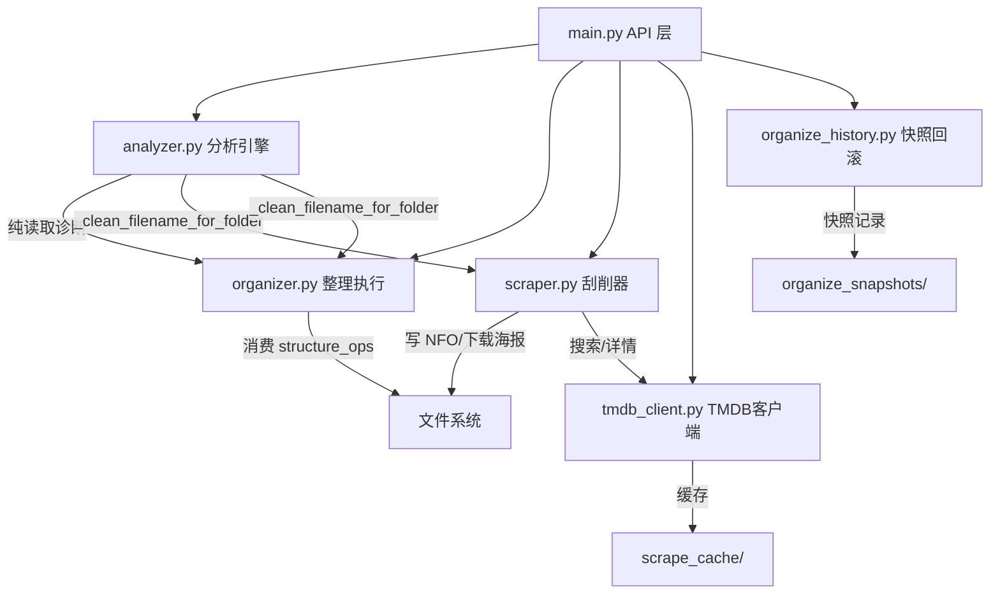
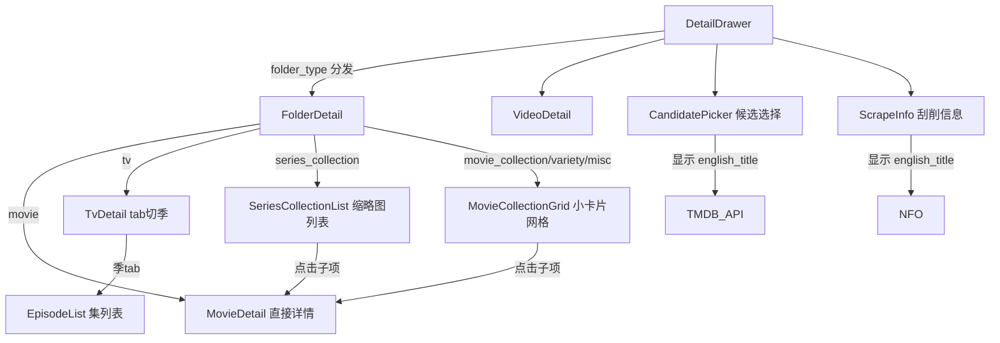

# 设计文档：媒体库整理功能补全（media-organize）

## 概述

本功能覆盖 NAS 媒体库整理的后端 P0（任务 1-7）和前端 P0（任务 11-16）。后端侧重于修复备份/快照机制、补充 season.nfo 刮削、CD 分片合并执行验证、跨文件夹散落季合并执行、刮削候选补 english_title、统一清洗逻辑、刮削搜索词优化。前端侧重于 4 种 folder_type 的差异化展示组件（series_collection 缩略图列表、movie_collection 小卡片网格、tv 季 tab 适配）以及 DetailDrawer 按 folder_type 分发布局、刮削候选/结果的 english_title 露出。

整体目标：让一键整理链路（分析 → 文件移动 → 多季规整 → 刮削 → 改名）的每个环节都能正确执行，前端能根据文件夹类型自动切换到最合适的展示模式。

## 架构

### 后端模块交互



### 前端组件架构



## 一键整理执行链路（时序图）

```mermaid
sequenceDiagram
    participant U as 用户/前端
    participant API as FastAPI
    participant ANA as analyzer
    participant ORG as organizer
    participant SCR as scraper
    participant TMDB as TMDBClient
    participant HIST as organize_history
    participant FS as 文件系统

    U->>API: POST /organize/one-click?path=xxx
    API->>HIST: create_snapshot(pre_state)
    
    rect rgb(40, 40, 60)
    Note over API,FS: Step 1: 分析
    API->>ANA: analyze_folder(path)
    ANA->>FS: 读取目录结构
    ANA-->>API: {structure_ops, rename_ops, scrape_issues...}
    end
    
    rect rgb(40, 60, 40)
    Note over API,FS: Step 2: 文件移动
    API->>ORG: organize_folder(path, dry_run=False)
    ORG->>FS: 执行 wrap_in_folder / move_to_subdir
    ORG->>FS: 移动关联文件(NFO/poster/字幕)
    ORG-->>API: {ops: [...]}
    end
    
    rect rgb(60, 40, 40)
    Note over API,FS: Step 3: 多季规整
    API->>ORG: reorganize_seasons(path)
    ORG->>FS: 拆分混季 / 合并散落季
    end
    
    rect rgb(40, 50, 60)
    Note over API,FS: Step 4: 刮削
    API->>SCR: scrape_folder(path)
    SCR->>ANA: _clean_filename_for_folder(name)
    SCR->>TMDB: search + get_detail
    SCR->>FS: 写 tvshow.nfo + season.nfo + movie.nfo
    SCR->>FS: 下载 poster/fanart
    end
    
    rect rgb(50, 40, 50)
    Note over API,FS: Step 5: 批量改名
    API->>ORG: rename_videos_in_folder(path)
    ORG->>SCR: read_nfo() 获取标准名
    ORG->>FS: 重命名视频+关联文件
    end
    
    API->>HIST: create_snapshot(post_ops)
    API-->>U: {status: "ok", snapshot_id}
```



</text>
</invoke>

## 组件与接口

### 后端组件

#### 组件 1：organize_history.py — 快照/回滚机制（任务 1）

**现状问题**：`create_snapshot` 只记录 `{old_path, new_path}` 对，但 `organize_folder` 执行后没有自动创建快照；`rollback` 不处理文件夹级别的回滚（只处理文件移动）。

**修复接口**：

```python
class OrganizeHistory:
    def create_snapshot(self, operations: List[Dict], label: str = "") -> int:
        """创建快照，新增 label 字段标识操作类型"""
        # label: "organize" | "rename" | "scrape" | "merge_seasons"
        ...

    def rollback(self, snapshot_id: int) -> Tuple[bool, Dict]:
        """回滚快照，支持文件夹级别回滚"""
        # 增强：检测 mkdir 操作，回滚时删除空目录
        ...

    def list_snapshots(self, limit: int = 20) -> List[Dict]:
        """列出快照，新增 limit 参数"""
        ...
```

**职责**：
- 每次 organize_folder 执行后自动创建快照
- 回滚时逆序执行，支持文件和文件夹的移动回退
- 回滚后清理空目录

#### 组件 2：scraper.py — season.nfo 刮削（任务 2）

**现状问题**：`scrape_folder` 递归时只写 `tvshow.nfo`，不写 `season.nfo` 和季封面。`write_season_nfo` 函数已存在但未被调用。

**增强接口**：

```python
def scrape_folder(folder_path: str, tmdb_client_instance, force: bool = False,
                  depth: int = 0, max_depth: int = 2) -> Dict:
    """增强：递归时检测季目录，为每个季目录写 season.nfo + 季封面"""
    # 新增逻辑：
    # 1. 识别季目录（_is_season_dir）
    # 2. 从 tvshow.nfo 读取 tmdb_id
    # 3. 调用 tmdb_client.get_season_detail(tv_id, season_num)
    # 4. 调用 write_season_nfo(season_dir, season_detail)
    # 5. 下载季封面到 season_dir/poster.jpg
    ...
```

#### 组件 3：organizer.py — CD 分片合并（任务 3）

**现状问题**：`organize_folder` 的 `wrap_in_folder` 已处理 CD 分组，但关联文件（NFO/poster/字幕）的归入逻辑需要验证——特别是 CD 分片的关联文件匹配规则。

**验证要点**：

```python
def _find_associated_files(folder, video_filename):
    """验证：CD 分片的关联文件能正确匹配
    例：阿甘正传CD1.mkv 的关联文件：
    - 阿甘正传CD1.nfo ✓（精确匹配 base）
    - 阿甘正传CD1-poster.jpg ✓（base + "-poster"）
    - 阿甘正传.srt ✗（不匹配，属于整体字幕）
    - 阿甘正传CD1.srt ✓（base 开头）
    """
    ...
```

#### 组件 4：organizer.py — 散落季合并执行（任务 4）

**现状问题**：`analyzer.py` 的 `_diagnose_scattered_seasons` 能检测散落季，但缺少执行函数。

**新增接口**：

```python
def merge_scattered_seasons(scattered_issue: Dict, dry_run: bool = True) -> Dict:
    """合并散落的季目录到同一父目录
    
    输入: analyzer 产出的 scattered_seasons issue
    {
        "type": "scattered_seasons",
        "core_name": "黑镜 Black Mirror",
        "folders": [
            {"name": "黑镜 第1季", "path": "/nas/黑镜 第1季"},
            {"name": "黑镜 第2季", "path": "/nas/黑镜 第2季"},
        ]
    }
    
    执行逻辑:
    1. 以 core_name 创建父目录（如果不存在）
    2. 将所有散落的季目录移入父目录
    3. 如果父目录已有 tvshow.nfo，保留；否则从第一个季目录的 NFO 推断
    
    返回: {"status": "ok", "ops": [...], "target_dir": "..."}
    """
    ...
```

#### 组件 5：main.py + tmdb_client.py — 刮削候选补 english_title（任务 5）

**现状问题**：`/scrape/candidates` API 返回的候选列表没有 `english_title` 字段。

**增强接口**：

```python
@app.get("/scrape/candidates")
def scrape_candidates(name: str):
    """增强：为每个候选项补充 english_title"""
    # 现有逻辑：search_movie + search_tv → candidates
    # 新增：对每个候选调用 _get_english_title(media_type, tmdb_id, original_title)
    # 注意：批量调用需控制并发，避免 TMDB 限流
    candidates = []
    for m in movies[:8]:
        en_title = ""
        orig = m.get("original_title", "")
        if _is_latin(orig):
            en_title = orig
        else:
            en_title = client._get_english_title("movie", m["id"], orig)
        candidates.append({
            ...,
            "english_title": en_title,  # 新增字段
        })
    ...
```

#### 组件 6：organizer.py — 统一清洗逻辑（任务 6）

**现状问题**：`generate_standard_name` 有自己的清洗逻辑，没有复用 `analyzer._clean_filename_for_folder`。

**修改方案**：

```python
def generate_standard_name(filename: str, scrape_data=None, video_info=None,
                           folder_title: str = "", is_collection: bool = False) -> str:
    """修改：当没有刮削数据时，用 _clean_filename_for_folder 清洗"""
    from analyzer import _clean_filename_for_folder
    # ...
    if not cn_title:
        # 原来：用 parsed["clean_name"]
        # 改为：用 _clean_filename_for_folder(filename) 获取更干净的名字
        cn_title = _clean_filename_for_folder(filename)
        if not cn_title:
            cn_title = folder_title or parsed["clean_name"]
    ...
```

#### 组件 7：main.py — 刮削搜索词优化（任务 7）

**现状问题**：`/scrape/candidates` 的搜索词用 `parse_filename` 清洗，但 `_clean_filename_for_folder` 清洗更彻底（去广告、去质量标签、去发布组）。

**修改方案**：

```python
@app.get("/scrape/candidates")
def scrape_candidates(name: str):
    from analyzer import _clean_filename_for_folder
    # 原来：parsed = parse_filename(name); query = parsed["clean_name"]
    # 改为：先用 _clean_filename_for_folder 清洗，再 fallback 到 parse_filename
    clean = _clean_filename_for_folder(name)
    if clean:
        query = clean
    else:
        parsed = tmdb_client.parse_filename(name)
        query = parsed["clean_name"] or name
    ...
```

### 前端组件

#### 组件 11：SeriesCollectionList — 系列电影缩略图列表

**用途**：series_collection 类型（如魔戒三部曲）的展示组件

```typescript
interface SeriesCollectionListProps {
  node: FolderNode;
  onSelectItem: (video: VideoInfo) => void;
  selectedPath: string | null;
}

// 布局：左侧小封面(60px) + 右侧标题/年份/时长，点击切换详情+封面跟随
function SeriesCollectionList({ node, onSelectItem, selectedPath }: SeriesCollectionListProps) {
  // 遍历 node.children（子文件夹）或 node.videos（直接视频）
  // 每项：小封面 | 标题 年份 时长
  // 选中项高亮，触发 onSelectItem → 父组件更新封面和详情
}
```

#### 组件 12：MovieCollectionGrid — 电影聚合小卡片网格

**用途**：movie_collection / variety / misc 类型的展示组件

```typescript
interface MovieCollectionGridProps {
  node: FolderNode;
  onSelectItem: (video: VideoInfo) => void;
}

// 布局：网格排列的小卡片，每个卡片有独立封面+标题
// 封面固定（不跟随选中项），点击进入子项详情
function MovieCollectionGrid({ node, onSelectItem }: MovieCollectionGridProps) {
  // 2列网格，每个卡片：封面(aspect-[2/3]) + 标题
  // 点击触发 onSelectItem
}
```

#### 组件 13：TvDetail — 剧集季 tab 适配

**用途**：tv 类型的展示组件，原 tv_season/tv_show 已合并为 tv

```typescript
interface TvDetailProps {
  node: FolderNode;
  onRefresh: () => void;
  onSearch: (q: string) => void;
}

// 布局：封面(跟随当前季) + 季tab + 集列表
function TvDetail({ node, onRefresh, onSearch }: TvDetailProps) {
  // 从 node.children 提取季目录
  // 如果没有子目录但有视频 → 单季模式，不显示 tab
  // 如果有季子目录 → 多季模式，显示 tab
  // 季封面从 season_dir/poster.jpg 加载
}
```

#### 组件 14：DetailDrawer 布局分发

**修改现有 FolderDetail**：读取 `node.folder_type`，分发到对应展示组件

```typescript
function FolderDetail({ node, onRefresh, onSearch }: FolderDetailProps) {
  const folderType = node.folder_type;
  
  // 根据 folder_type 分发
  switch (folderType) {
    case "movie":
      return <MovieDetail node={node} ... />;
    case "tv":
      return <TvDetail node={node} ... />;
    case "series_collection":
      return <SeriesCollectionList node={node} ... />;
    case "movie_collection":
    case "variety":
    case "misc":
      return <MovieCollectionGrid node={node} ... />;
    default:
      return <DefaultFolderDetail node={node} ... />;
  }
}
```

#### 组件 15-16：CandidatePicker / ScrapeInfo 英文名显示

```typescript
// CandidatePicker 候选项增加 english_title
interface CandidateItem {
  tmdb_id: number;
  media_type: string;
  title: string;
  original_title: string;
  english_title: string;  // 新增
  year: string;
  overview: string;
  poster_url: string | null;
}

// ScrapeInfo 已有 english_title 字段，确认所有入口一致显示
```

</text>
</invoke>

## 数据模型

### 后端数据模型

#### ScatteredSeasonIssue（散落季诊断结果）

```python
# analyzer.py 产出的跨文件夹散落季问题
ScatteredSeasonIssue = {
    "type": "scattered_seasons",
    "match_method": "text" | "tmdb_id",
    "core_name": str,           # 作品核心名
    "tmdb_id": Optional[int],   # TMDB ID（tmdb_id 匹配时有值）
    "folders": [
        {"name": str, "path": str}
    ],
    "severity": "high",
    "auto_fixable": True,
}
```

**验证规则**：
- `folders` 至少包含 2 个元素
- 所有 `path` 必须存在且为目录
- `core_name` 非空

#### OrganizeSnapshot（增强版快照）

```python
OrganizeSnapshot = {
    "id": int,                  # 时间戳
    "time": str,                # 可读时间
    "label": str,               # 操作类型标签
    "ops": [
        {
            "old_path": str,
            "new_path": str,
            "is_dir": bool,     # 新增：标识是否为目录操作
        }
    ]
}
```

#### ScrapeCandidate（增强版刮削候选）

```python
ScrapeCandidate = {
    "tmdb_id": int,
    "media_type": str,
    "title": str,
    "original_title": str,
    "english_title": str,       # 新增
    "year": str,
    "overview": str,
    "poster_url": Optional[str],
    "popularity": float,
}
```

### 前端数据模型

#### FolderNode 扩展（已有，确认 folder_type 字段）

```typescript
// types/index.ts — 已有 folder_type 字段
interface FolderNode {
  name: string;
  path: string;
  children: FolderNode[];
  videos: VideoInfo[];
  video_count: number;
  has_cover: boolean;
  is_category?: boolean;
  folder_type?: string;  // "movie" | "tv" | "series_collection" | "movie_collection" | "variety" | "misc"
}
```

## 关键函数的形式化规约

### merge_scattered_seasons()

```python
def merge_scattered_seasons(scattered_issue: Dict, dry_run: bool = True) -> Dict:
    """合并散落的季目录到同一父目录"""
    ...
```

**前置条件**：
- `scattered_issue["type"] == "scattered_seasons"`
- `len(scattered_issue["folders"]) >= 2`
- 所有 `folder["path"]` 指向存在的目录
- 所有散落目录位于同一父目录下（同级）

**后置条件**：
- 返回 `{"status": "ok", "ops": [...], "target_dir": str}`
- `dry_run=True` 时不修改文件系统
- `dry_run=False` 时：
  - 创建以 `core_name` 命名的父目录（如不存在）
  - 所有散落季目录移入父目录
  - 原位置不再存在散落目录
  - 如果父目录已有 tvshow.nfo，保留不覆盖

**循环不变量**：
- 每次移动操作后，已移动的目录在新位置可访问
- 未移动的目录在原位置仍可访问

### scrape_folder() 增强（season.nfo 写入）

```python
def scrape_folder(folder_path, tmdb_client_instance, force=False, depth=0, max_depth=2):
    """增强：递归时为季目录写 season.nfo"""
    ...
```

**前置条件**：
- `folder_path` 是有效目录
- `tmdb_client_instance` 已初始化且 API key 有效

**后置条件**：
- 对于 tv 类型文件夹，每个季子目录都有 `season.nfo`
- `season.nfo` 包含 `seasonnumber`、`title`、`plot`、`aired` 字段
- 季封面下载到 `season_dir/poster.jpg`
- 不覆盖已存在的 `season.nfo`（除非 `force=True`）

### organize_folder() — wrap_in_folder CD 分片处理

```python
def organize_folder(folder_path, tmdb_client=None, dry_run=True, library_data=None):
    """CD 分片合并：同组 CD 文件移入同一目标文件夹"""
    ...
```

**前置条件**：
- `folder_path` 是有效目录
- `structure_ops` 中 CD 分片的 `target_folder` 相同

**后置条件**：
- 同组 CD 文件（如 CD1, CD2）移入同一文件夹
- 每个 CD 文件的关联文件（同名 .nfo、-poster.jpg、.srt 等）跟随移动
- 非 CD 关联的同名文件不被错误移动
- 目标文件夹名由 `_clean_filename_for_folder` 生成

## 算法伪代码

### 散落季合并算法

```python
def merge_scattered_seasons(issue: Dict, dry_run: bool = True) -> Dict:
    """
    INPUT: issue — scattered_seasons 诊断结果
    OUTPUT: {"status": str, "ops": List[Dict], "target_dir": str}
    """
    folders = issue["folders"]
    core_name = issue["core_name"]
    
    # 确定父目录：所有散落目录的共同父目录
    parent_dir = os.path.dirname(folders[0]["path"])
    target_dir = os.path.join(parent_dir, core_name)
    
    ops = []
    
    # 检查目标目录是否已存在（可能是其中一个散落目录本身）
    existing_target = None
    for f in folders:
        if os.path.basename(f["path"]) == core_name:
            existing_target = f["path"]
            break
    
    if not existing_target:
        ops.append({"action": "mkdir", "path": target_dir})
    else:
        target_dir = existing_target
    
    # 移动每个散落目录到目标目录下
    for f in folders:
        if f["path"] == target_dir:
            continue  # 跳过已在目标位置的
        season_name = os.path.basename(f["path"])
        new_path = os.path.join(target_dir, season_name)
        ops.append({
            "action": "move_dir",
            "old": f["path"],
            "new": new_path,
        })
    
    if not dry_run:
        os.makedirs(target_dir, exist_ok=True)
        for op in ops:
            if op["action"] == "move_dir":
                if os.path.exists(op["old"]):
                    shutil.move(op["old"], op["new"])
    
    return {"status": "ok", "ops": ops, "target_dir": target_dir}
```

### season.nfo 刮削增强算法

```python
def _scrape_season_nfos(folder_path: str, tmdb_client_instance, tv_tmdb_id: int, force: bool):
    """
    INPUT: tv 类型文件夹路径, TMDB 客户端, 剧的 TMDB ID
    OUTPUT: 为每个季目录写入 season.nfo + 下载季封面
    
    PRECONDITION: folder_path 包含季子目录, tv_tmdb_id > 0
    POSTCONDITION: 每个季目录有 season.nfo 和 poster.jpg
    """
    from organizer import _is_season_dir, _extract_season_number, _is_ignorable_subdir
    
    proxy = getattr(tmdb_client_instance, 'proxy', '') or ''
    
    for item in os.listdir(folder_path):
        sub_path = os.path.join(folder_path, item)
        if not os.path.isdir(sub_path) or not _is_season_dir(item):
            continue
        
        # 跳过已有 season.nfo 的（除非 force）
        if not force and os.path.exists(os.path.join(sub_path, "season.nfo")):
            continue
        
        season_num = _extract_season_number(item)
        if season_num is None:
            continue
        
        # 获取季详情
        season_detail = tmdb_client_instance.get_season_detail(tv_tmdb_id, season_num)
        if not season_detail.tmdb_id:
            continue
        
        # 写 season.nfo
        write_season_nfo(sub_path, season_detail)
        
        # 下载季封面
        if season_detail.poster_url:
            download_poster(sub_path, season_detail.poster_url, "poster.jpg", proxy)
```

### 刮削搜索词优化算法

```python
def _get_clean_search_query(name: str) -> str:
    """
    INPUT: 原始文件/文件夹名
    OUTPUT: 清洗后的搜索词
    
    POSTCONDITION: 返回值不含广告标签、质量标签、发布组标签
    优先级: _clean_filename_for_folder > parse_filename > 原始名
    """
    from analyzer import _clean_filename_for_folder
    
    # 第一优先：用 _clean_filename_for_folder 深度清洗
    clean = _clean_filename_for_folder(name)
    if clean and len(clean) >= 2:
        return clean
    
    # 第二优先：用 parse_filename 基础清洗
    parsed = parse_filename(name)
    if parsed["clean_name"] and len(parsed["clean_name"]) >= 2:
        return parsed["clean_name"]
    
    # 兜底：原始名
    return os.path.splitext(name)[0] if "." in name else name
```

## 示例用法

### 后端：散落季合并

```python
# 分析层检测到散落季
report = analyzer.analyze_library("/nas/视频/")
for issue in report["cross_folder_issues"]:
    if issue["type"] == "scattered_seasons":
        # 预览
        preview = organizer.merge_scattered_seasons(issue, dry_run=True)
        print(f"将合并 {len(preview['ops'])} 个目录到 {preview['target_dir']}")
        
        # 执行
        result = organizer.merge_scattered_seasons(issue, dry_run=False)
```

### 后端：season.nfo 刮削

```python
# scrape_folder 递归时自动写 season.nfo
result = scraper.scrape_folder("/nas/视频/黑镜 Black Mirror/", tmdb_client, force=False)
# 结果：
# /nas/视频/黑镜 Black Mirror/tvshow.nfo ✓
# /nas/视频/黑镜 Black Mirror/Season 01/season.nfo ✓ (新增)
# /nas/视频/黑镜 Black Mirror/Season 01/poster.jpg ✓ (新增)
# /nas/视频/黑镜 Black Mirror/Season 02/season.nfo ✓ (新增)
```

### 前端：DetailDrawer 按 folder_type 分发

```typescript
// DetailDrawer 内部
function FolderDetail({ node, onRefresh, onSearch }) {
  const [selectedChild, setSelectedChild] = useState<VideoInfo | null>(null);
  
  switch (node.folder_type) {
    case "series_collection":
      return (
        <div className="p-5 space-y-4">
          <Poster localPath={selectedChild?.file_path || node.path} />
          <SeriesCollectionList
            node={node}
            onSelectItem={setSelectedChild}
            selectedPath={selectedChild?.file_path || null}
          />
          <ActionButtons node={node} isAggregate={true} />
        </div>
      );
    case "movie_collection":
    case "variety":
    case "misc":
      return (
        <div className="p-5 space-y-4">
          <Poster localPath={node.path} />
          <MovieCollectionGrid node={node} onSelectItem={setSelectedChild} />
          <ActionButtons node={node} isAggregate={true} />
        </div>
      );
    // ...
  }
}
```

### 前端：CandidatePicker 显示 english_title

```typescript
// CandidatePicker 候选列表项
function CandidateItem({ item }: { item: CandidateItem }) {
  return (
    <div className="flex gap-3 p-2 hover:bg-white/[0.04] rounded-lg cursor-pointer">
      {item.poster_url && }
      <div className="flex-1 min-w-0">
        <div className="text-sm text-white truncate">{item.title}</div>
        {item.english_title && item.english_title !== item.title && (
          <div className="text-xs text-slate-500 truncate">{item.english_title}</div>
        )}
        <div className="text-xs text-slate-600">{item.year} · {item.media_type}</div>
      </div>
    </div>
  );
}
```

</text>
</invoke>

## Correctness Properties

*A property is a characteristic or behavior that should hold true across all valid executions of a system—essentially, a formal statement about what the system should do. Properties serve as the bridge between human-readable specifications and machine-verifiable correctness guarantees.*

### Property 1: 快照自动创建与结构完整性

*For any* organize_folder 执行（dry_run=False），执行后 organize_snapshots/ 中存在对应快照文件，且快照的 ops 列表与实际文件移动操作一一对应，每条操作记录包含 is_dir 字段和有效的 label 字段

**Validates: Requirements 1.1, 1.2, 1.3**

### Property 2: 快照回滚对称性

*For any* snapshot，rollback(snapshot_id) 后所有文件恢复到原始位置，且由整理操作创建的空目录被自动清理

**Validates: Requirements 2.1, 2.2**

### Property 3: season.nfo 完整性与一致性

*For any* tv 类型文件夹刮削后，每个季子目录都有 season.nfo（包含 seasonnumber、title、plot、aired 字段），且 seasonnumber 字段值与目录名中提取的季号一致，同时季封面下载到 poster.jpg

**Validates: Requirements 3.2, 3.3, 3.4, 3.6**

### Property 4: CD 分片合并完整性

*For any* CD 分组，wrap_in_folder 后同组所有 CD 文件及其关联文件（仅匹配以 CD 文件基础名开头的文件）都在同一目标文件夹中，且目标文件夹名由 Clean_Function 生成

**Validates: Requirements 4.1, 4.2, 4.3, 4.4**

### Property 5: 散落季合并正确性

*For any* scattered_seasons issue，merge_scattered_seasons(dry_run=False) 后所有季目录位于以 core_name 命名的同一父目录下，且原位置不再存在散落目录

**Validates: Requirements 5.3, 5.5**

### Property 6: 散落季 dry_run 无副作用

*For any* scattered_seasons issue，merge_scattered_seasons(dry_run=True) 返回预览操作列表，且文件系统状态不发生任何变化

**Validates: Requirement 5.2**

### Property 7: english_title 候选项完整性

*For any* scrape_candidates 返回的候选项，english_title 字段存在；当 original_title 为拉丁字符时 english_title 等于 original_title

**Validates: Requirements 6.1, 6.2**

### Property 8: 清洗函数统一使用与幂等性

*For any* 文件名，generate_standard_name（无刮削数据时）和刮削搜索词构造都经过 Clean_Function 清洗；且 Clean_Function 满足幂等性：clean(clean(name)) == clean(name)

**Validates: Requirements 7.1, 7.3, 8.1**

### Property 9: 搜索词清洗降级链

*For any* 文件名，搜索词构造按优先级降级：Clean_Function 结果（≥2字符）→ parse_filename 的 clean_name（≥2字符）→ 去扩展名的原始名，且最终结果非空

**Validates: Requirements 8.1, 8.2, 8.3**

### Property 10: folder_type 分发正确性

*For any* FolderNode，DetailDrawer 根据 folder_type 渲染对应组件：movie→MovieDetail, tv→TvDetail, series_collection→SeriesCollectionList, movie_collection/variety/misc→MovieCollectionGrid，未知类型→默认 FolderDetail

**Validates: Requirements 9.1, 9.2, 9.3, 9.4, 9.5**

### Property 11: 封面跟随规则

*For any* series_collection 节点中的子项选中操作，父组件封面更新为选中子项的封面；*For any* movie_collection 节点中的子项选中操作，父组件封面保持不变

**Validates: Requirements 10.3, 11.3**

### Property 12: english_title 前端显示一致性

*For any* 候选项或刮削结果，CandidatePicker 和 ScrapeInfo 的 english_title 显示逻辑一致：当 english_title 存在且不等于 title 时显示，否则不显示

**Validates: Requirements 13.2, 13.3, 14.2, 14.3, 14.4**

### Property 13: 快照列表排序

*For any* 快照列表查询结果，返回的快照按时间倒序排列

**Validates: Requirement 1.4**

## 错误处理

### 场景 1：散落季合并时目标目录已存在同名子目录

**条件**：目标父目录下已有同名季目录（如手动创建的）
**响应**：跳过该季目录的移动，记录到 ops 中标记为 `"action": "skip"`
**恢复**：用户可手动处理冲突

### 场景 2：TMDB API 限流导致 english_title 获取失败

**条件**：批量获取 english_title 时触发 TMDB 429 限流
**响应**：该候选项的 english_title 返回空字符串，不阻塞其他候选项
**恢复**：前端不显示 english_title 行，用户可重新搜索

### 场景 3：season.nfo 写入失败（权限/磁盘满）

**条件**：NAS 文件系统写入失败
**响应**：记录错误日志，继续处理下一个季目录
**恢复**：用户可重新执行刮削（force=True）

### 场景 4：快照回滚时文件已被手动移动

**条件**：用户在快照创建后手动移动了文件
**响应**：该操作标记为 failed，继续回滚其他操作
**恢复**：返回 failed 列表，用户手动处理

### 场景 5：folder_type 为空或未知

**条件**：classify_folder 返回 unknown 或空字符串
**响应**：DetailDrawer 回退到默认布局（当前的 FolderDetail）
**恢复**：无需恢复，默认布局包含所有基础功能

## 测试策略

### 单元测试

- `merge_scattered_seasons`：测试 dry_run 模式返回正确的 ops 列表
- `_scrape_season_nfos`：mock TMDB 客户端，验证 season.nfo 写入内容
- `_find_associated_files`：测试 CD 分片的关联文件匹配
- `_get_clean_search_query`：测试各种脏文件名的清洗结果
- `generate_standard_name` 复用 `_clean_filename_for_folder`：验证输出一致性

### 属性测试

**属性测试库**：hypothesis（Python）

- CD 分片分组属性：∀ 文件名列表，同组 CD 文件的 `_extract_cd_group_key` 返回相同 key
- 清洗幂等性：∀ 文件名，`_clean_filename_for_folder(_clean_filename_for_folder(name)) == _clean_filename_for_folder(name)`
- 快照回滚对称性：∀ 操作序列，create_snapshot → rollback 后文件系统状态恢复

### 集成测试

- 一键整理全链路：创建临时目录结构 → 执行 organize_folder → 验证文件位置
- 刮削候选 english_title：mock TMDB API → 验证返回的候选项都有 english_title
- 前端 folder_type 分发：渲染 DetailDrawer 传入不同 folder_type 的 node → 验证渲染的组件类型

## 性能考量

- `scrape_candidates` 补 english_title 需要额外 TMDB API 调用（每个候选 1 次），但有文件缓存（`scrape_cache/en_{type}_{id}.json`），重复查询不会触发网络请求
- 散落季合并是同盘移动（NAS 同分区），速度很快（毫秒级）
- season.nfo 刮削在 scrape_folder 递归中执行，每季 1 次 TMDB API 调用，受 TMDB 限流约束（40 次/10 秒）

## 安全考量

- 所有文件操作前创建快照，支持回滚
- `merge_scattered_seasons` 不删除任何文件，只移动目录
- 文件名清洗使用白名单方式去除非法字符（`[<>:"/\\|?*]`）

## 依赖

- 后端：Python 3.x, FastAPI, requests, pydantic, xml.etree.ElementTree
- 前端：Next.js 16, React 19, Tailwind CSS 4
- 外部服务：TMDB API（刮削/搜索/英文名获取）
- 文件系统：NAS SMB 共享（`\\DS218play\share\视频\`）
</text>
</invoke>