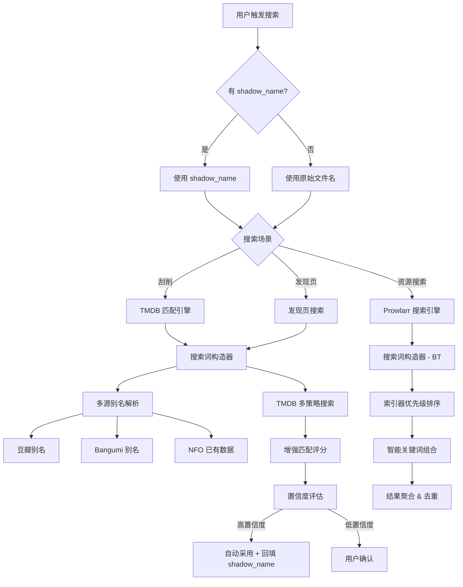
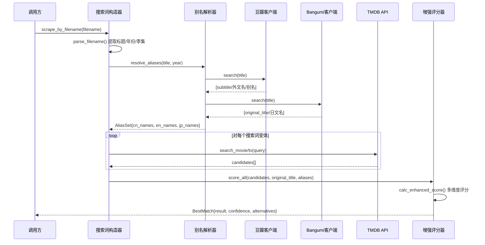
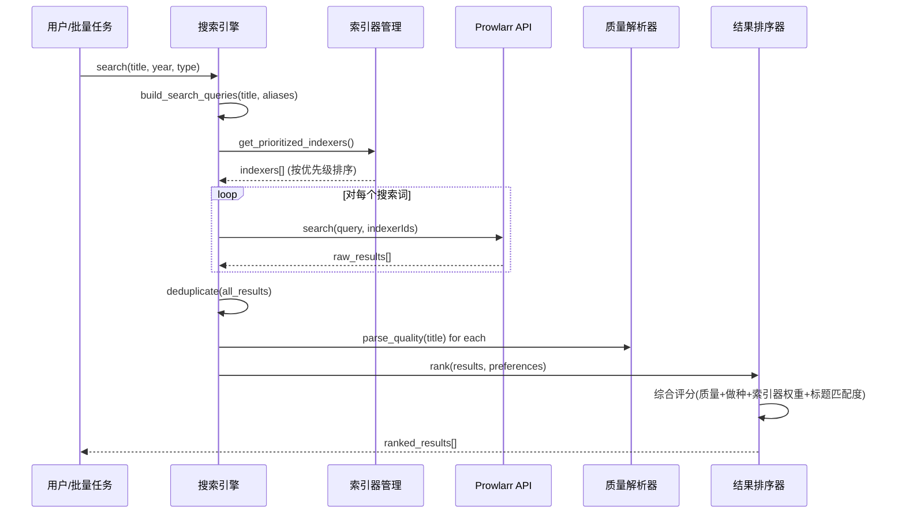
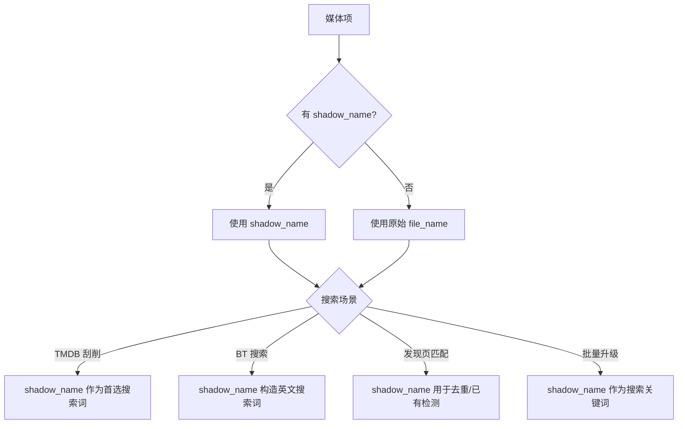

# 设计文档：搜索匹配准确性提升 (search-accuracy)

## 概述

本功能旨在全面提升 NAS 影视媒体库管理工具的搜索匹配准确性，直接影响三大核心场景：TMDB 刮削匹配、发现页影片识别、以及 Prowlarr BT 资源搜索替换。

当前系统的核心痛点在于：英文是 TMDB 和 Prowlarr 的主要搜索源，而用户的媒体库以中文影片为主，中文标题与 TMDB 翻译名经常不一致（如"坐白车的女人"在 TMDB 上的中文翻译完全不同），导致匹配失败率偏高。现有的 4 级 fallback 搜索策略（中文标题 → subtitle → 豆瓣获取外文名 → 英文搜索）虽然覆盖了基本场景，但在匹配评分算法、搜索词构造、以及 Prowlarr 索引器优先级等方面仍有较大优化空间。

本设计将从四个维度进行改进：(1) 引入"影子名"（Shadow Name）机制，为每个媒体项维护一个隐藏的标准化名称，不修改实际文件名，但所有搜索/刮削/匹配都优先使用影子名；(2) 增强 TMDB 匹配算法，引入模糊匹配、别名扩展和多源交叉验证；(3) 优化 Prowlarr 搜索策略，支持索引器优先级配置和智能搜索词构造；(4) 建立匹配置信度体系，让用户在低置信度时可以手动干预。

## 架构

### 整体搜索匹配流程



### TMDB 匹配引擎增强流程



### Prowlarr 搜索优化流程



## 影子名机制 (Shadow Name)

### 核心概念

影子名是一个"隐藏的标准化名称"，存储在媒体库 JSON 中，不修改实际文件/文件夹名。所有搜索、刮削、BT 资源匹配都优先使用影子名，而非原始文件名。

**为什么需要影子名**：
- 用户的文件名可能是中文、拼音、缩写、甚至乱码，直接拿去搜 TMDB/BT 站命中率低
- 批量重命名虽然能解决问题，但用户可能有特殊的命名习惯不想改
- 影子名相当于一个"搜索别名"，用户看不到，但系统内部用它来做所有匹配

### 影子名的生成和存储

影子名存储在 `media_library.json` 的每个条目中，新增 `shadow_name` 字段：

```json
{
    "file_path": "\\\\DS218play\\share\\视频\\你妈妈也一样.And.Your.Mother.Too.2001.BD720P.mp4",
    "file_name": "你妈妈也一样.And.Your.Mother.Too.2001.BD720P.中西双字-玛丽维尔·贝尔杜.mp4",
    "shadow_name": "Y Tu Mamá También (2001)",
    "shadow_name_source": "tmdb",
    ...
}
```

对于文件夹级别的媒体（独立子文件夹），影子名存储在文件夹的代表条目中：

```json
{
    "folder_name": "national geographic ultimate factory\\国家地理：超级工厂：法拉利跑车 (2006)",
    "shadow_name": "National Geographic Ultimate Factories: Ferrari (2006)",
    "shadow_name_source": "manual",
    ...
}
```

### 影子名的生成来源（优先级从高到低）

1. **用户手动设置**（`source: "manual"`）— 用户在详情面板中手动输入，最高优先级
2. **TMDB 刮削结果**（`source: "tmdb"`）— 刮削成功后，自动用 TMDB 的英文原名 + 年份填充
3. **NFO 文件**（`source: "nfo"`）— 从已有 NFO 的 `<originaltitle>` 字段提取
4. **豆瓣/Bangumi**（`source: "douban"` / `"bangumi"`）— 从豆瓣 subtitle 或 Bangumi original_title 提取
5. **文件名解析**（`source: "parsed"`）— 从文件名中解析出的英文部分（fallback）

### 影子名在各场景的使用



### 影子名管理 API

```python
# 后端新增 API 端点

@app.post("/media/shadow-name")
async def set_shadow_name(path: str, shadow_name: str, source: str = "manual"):
    """手动设置影子名"""
    ...

@app.post("/media/shadow-name/batch")
async def batch_generate_shadow_names():
    """批量生成影子名（基于已有 NFO/刮削数据）"""
    ...

@app.delete("/media/shadow-name")
async def clear_shadow_name(path: str):
    """清除影子名，恢复使用原始文件名"""
    ...
```

### 前端交互

- 详情面板（DetailDrawer）中显示影子名编辑入口，默认折叠
- 显示当前影子名 + 来源标签（如 "TMDB"、"手动"）
- 支持手动编辑和清除
- 批量操作：设置页或批处理页可一键为所有已刮削的媒体生成影子名
- 影子名不为空时，搜索升级弹窗的搜索框默认填入影子名而非文件名

### 影子名自动填充时机

- **刮削成功时**：自动用 TMDB 返回的 `original_title` + `(year)` 填充（如果当前没有手动设置的影子名）
- **扫描时**：如果文件夹下有 NFO，从 NFO 提取 `<originaltitle>` 填充
- **发现页入库时**：下载的新影片自动带上 TMDB 英文名作为影子名

## 组件和接口

### 组件 0：影子名管理器 (ShadowNameManager)

**用途**：管理媒体项的影子名，提供读写和批量生成能力。

```python
@dataclass
class ShadowNameEntry:
    """影子名条目"""
    shadow_name: str              # 标准化名称，如 "The Wandering Earth 2 (2023)"
    source: str                   # "manual" | "tmdb" | "nfo" | "douban" | "bangumi" | "parsed"
    tmdb_id: Optional[int] = None # 关联的 TMDB ID（如果有）
    media_type: str = ""          # "movie" | "tv"

class ShadowNameManager:
    def __init__(self, library_path: str = "media_library.json"):
        self.library_path = library_path

    def get(self, file_path: str) -> Optional[ShadowNameEntry]:
        """获取指定媒体项的影子名"""
        ...

    def set(self, file_path: str, shadow_name: str,
            source: str = "manual",
            tmdb_id: Optional[int] = None) -> None:
        """设置影子名（手动设置的优先级最高，不会被自动覆盖）"""
        ...

    def auto_fill(self, file_path: str, shadow_name: str,
                  source: str, tmdb_id: Optional[int] = None) -> bool:
        """自动填充影子名（仅当没有手动设置时才生效）
        返回 True 表示填充成功，False 表示已有手动设置被跳过"""
        ...

    def clear(self, file_path: str) -> None:
        """清除影子名"""
        ...

    def batch_generate(self) -> dict:
        """批量为已刮削的媒体生成影子名
        返回 {"generated": int, "skipped": int, "failed": int}"""
        ...

    def get_search_name(self, file_path: str) -> str:
        """获取用于搜索的名称：优先影子名，fallback 到原始文件名"""
        ...
```

**职责**：
- 读写 media_library.json 中的 shadow_name 字段
- 手动设置的影子名不会被自动填充覆盖（source="manual" 优先级最高）
- 批量从 NFO/TMDB 缓存生成影子名
- 提供统一的 `get_search_name()` 接口，所有搜索场景调用此方法获取搜索关键词

### 组件 1：别名解析器 (AliasResolver)

**用途**：从多个数据源收集影片的所有已知名称变体，为搜索提供更丰富的关键词。

```python
from dataclasses import dataclass, field
from typing import List, Optional

@dataclass
class AliasSet:
    """影片别名集合"""
    cn_names: List[str] = field(default_factory=list)   # 中文名变体
    en_names: List[str] = field(default_factory=list)   # 英文名变体
    jp_names: List[str] = field(default_factory=list)   # 日文名变体
    original_title: str = ""                             # 原始标题
    year: str = ""
    source: str = ""  # 别名来源标记

class AliasResolver:
    def __init__(self, douban_client, bangumi_client):
        self.douban = douban_client
        self.bangumi = bangumi_client
        self._cache: dict[str, AliasSet] = {}

    def resolve(self, title: str, year: str = "",
                media_type: str = "") -> AliasSet:
        """解析影片别名，合并多源结果"""
        ...

    def _from_douban(self, title: str) -> AliasSet:
        """从豆瓣搜索建议提取别名"""
        ...

    def _from_bangumi(self, title: str) -> AliasSet:
        """从 Bangumi 搜索提取别名（主要用于动画）"""
        ...

    def _from_nfo(self, folder_path: str) -> AliasSet:
        """从已有 NFO 文件提取别名"""
        ...
```

**职责**：
- 从豆瓣搜索建议中提取 subtitle（外文名/别名）
- 从 Bangumi 搜索中提取 original_title（日文原名）
- 从已有 NFO 文件中提取 original_title
- 缓存已解析的别名，避免重复请求
- 合并去重所有名称变体

### 组件 2：增强匹配评分器 (EnhancedScorer)

**用途**：替换现有的 `calc_match_score`，引入更多维度的评分和模糊匹配能力。

```python
from dataclasses import dataclass

@dataclass
class MatchResult:
    """匹配结果，包含置信度"""
    item: dict                    # TMDB 搜索结果原始数据
    score: int                    # 综合评分 (0-150)
    confidence: str               # "high" | "medium" | "low"
    match_details: dict           # 各维度得分明细
    tmdb_id: int = 0
    media_type: str = ""          # "movie" | "tv"

class EnhancedScorer:
    # 置信度阈值
    HIGH_CONFIDENCE = 80
    MEDIUM_CONFIDENCE = 50
    LOW_CONFIDENCE = 30

    def score_candidate(self, query: str, candidate: dict,
                        aliases: AliasSet,
                        year: Optional[str] = None) -> MatchResult:
        """对单个候选项进行多维度评分"""
        ...

    def best_match(self, query: str, candidates: List[dict],
                   aliases: AliasSet,
                   year: Optional[str] = None) -> Optional[MatchResult]:
        """从候选列表中选出最佳匹配"""
        ...

    def _fuzzy_score(self, s1: str, s2: str) -> float:
        """基于编辑距离的模糊匹配评分 (0.0-1.0)"""
        ...

    def _alias_match_score(self, query_norm: str,
                           aliases: AliasSet) -> int:
        """别名交叉匹配加分"""
        ...
```

**职责**：
- 精确匹配（100分）、前缀匹配（70分）、包含匹配（50分）、模糊匹配（30-40分）
- 别名交叉验证加分（+15~25分）
- 年份匹配/不匹配（+20/-30分）
- 热度加分（最高+10分）
- 输出置信度等级，供调用方决定是否需要用户确认

### 组件 3：索引器优先级管理 (IndexerPriorityManager)

**用途**：管理 Prowlarr 索引器的优先级配置，支持按内容类型调整搜索策略。

```python
@dataclass
class IndexerConfig:
    """索引器配置"""
    indexer_id: int
    name: str
    priority: int = 50           # 0-100，越高越优先
    enabled: bool = True
    preferred_types: List[str] = field(default_factory=list)  # ["anime", "movie", "tv"]
    supports_chinese: bool = False

class IndexerPriorityManager:
    def __init__(self, config_path: str = "config.json"):
        self.config_path = config_path
        self.indexers: List[IndexerConfig] = []

    def load(self) -> List[IndexerConfig]:
        """从配置文件加载索引器优先级"""
        ...

    def save(self, indexers: List[IndexerConfig]):
        """保存索引器优先级配置"""
        ...

    def get_prioritized(self, media_type: str = "") -> List[IndexerConfig]:
        """按优先级排序返回索引器列表，可按媒体类型过滤"""
        ...
```

**职责**：
- 持久化索引器优先级配置到 config.json
- 按媒体类型（动画/电影/剧集）返回不同的索引器优先级
- 支持标记索引器是否支持中文搜索
- 提供 API 供前端设置页管理

### 组件 4：智能搜索词构造器 (SearchQueryBuilder)

**用途**：根据影片信息和别名，构造多个搜索词变体，提高搜索命中率。

```python
class SearchQueryBuilder:
    def build_tmdb_queries(self, title: str, aliases: AliasSet,
                           year: str = "") -> List[str]:
        """构造 TMDB 搜索词列表（按优先级排序）
        
        策略：
        1. 原始中文标题
        2. 豆瓣 subtitle（外文名）
        3. Bangumi original_title（日文名）
        4. 去除副标题的简化版本
        5. 英文名变体
        """
        ...

    def build_bt_queries(self, title: str, aliases: AliasSet,
                         year: str = "",
                         media_type: str = "") -> List[str]:
        """构造 BT 搜索词列表
        
        策略：
        1. 英文名 + 年份（BT 站英文为主）
        2. 原始标题（中文站可能支持）
        3. 日文名（动画资源）
        4. 简化英文名（去除冠词/介词）
        """
        ...

    def _simplify_title(self, title: str) -> str:
        """简化标题：去除副标题、冒号后内容等"""
        ...

    def _romanize_title(self, title: str) -> Optional[str]:
        """中文标题转拼音（作为最后手段）"""
        ...
```

**职责**：
- 为 TMDB 搜索和 BT 搜索分别构造优化的搜索词
- 处理副标题分割（如"哈利·波特：魔法石"→"哈利·波特"）
- 去除搜索干扰词（连字符、特殊符号等）
- 按搜索成功概率排序搜索词

## 数据模型

### 影子名数据模型（扩展 media_library.json 条目）

```python
class MediaItem(BaseModel):
    """媒体库条目（扩展）"""
    # ... 现有字段 ...
    shadow_name: Optional[str] = None          # 影子名
    shadow_name_source: Optional[str] = None   # "manual"|"tmdb"|"nfo"|"douban"|"bangumi"|"parsed"
    shadow_tmdb_id: Optional[int] = None       # 影子名关联的 TMDB ID
```

**验证规则**：
- shadow_name_source 为 "manual" 时，auto_fill 不会覆盖
- shadow_tmdb_id 存在时，可用于直接获取 TMDB 详情（跳过搜索）

### 匹配置信度模型

```python
class MatchConfidence(BaseModel):
    """匹配置信度"""
    level: str          # "high" | "medium" | "low"
    score: int          # 0-150
    reasons: List[str]  # 评分依据说明
    alternatives: int   # 备选匹配数量
```

**验证规则**：
- level 必须是 "high"/"medium"/"low" 之一
- score 范围 0-150
- high: score >= 80, medium: 50-79, low: < 50

### 索引器配置模型（扩展 AppConfig）

```python
class IndexerPriority(BaseModel):
    """索引器优先级配置"""
    indexer_name: str
    priority: int = 50          # 0-100
    enabled: bool = True
    preferred_types: List[str] = []  # ["anime", "movie", "tv"]

class AppConfig(BaseModel):
    # ... 现有字段 ...
    indexer_priorities: List[IndexerPriority] = []
    search_confidence_threshold: str = "medium"  # 自动采用的最低置信度
```

**验证规则**：
- priority 范围 0-100
- preferred_types 只能包含 "anime"、"movie"、"tv"
- search_confidence_threshold 只能是 "high"、"medium"、"low"

### 前端类型扩展

```typescript
// types/index.ts 新增类型

/** 影子名信息 */
interface ShadowName {
  name: string;
  source: "manual" | "tmdb" | "nfo" | "douban" | "bangumi" | "parsed";
  tmdb_id?: number;
}

/** 匹配置信度 */
interface MatchConfidence {
  level: "high" | "medium" | "low";
  score: number;
  reasons: string[];
  alternatives: number;
}

/** 增强的刮削结果（含置信度） */
interface EnhancedScrapeResult extends ScrapeResult {
  confidence: MatchConfidence;
  alternative_matches?: ScrapeResult[];
}

/** 索引器优先级配置 */
interface IndexerPriority {
  indexer_name: string;
  priority: number;
  enabled: boolean;
  preferred_types: ("anime" | "movie" | "tv")[];
}

/** 扩展 AppConfig */
interface AppConfig {
  // ... 现有字段 ...
  indexer_priorities: IndexerPriority[];
  search_confidence_threshold: "high" | "medium" | "low";
}
```

## 算法伪代码

### 核心算法 1：增强 TMDB 搜索匹配

```python
def enhanced_scrape_by_filename(self, filename: str,
                                file_path: str = "") -> MatchResult:
    """增强版文件名刮削 — 替换现有 scrape_by_filename"""
    
    # 前置条件：filename 非空
    # 后置条件：返回 MatchResult，confidence 反映匹配质量
    #          刮削成功时自动回填 shadow_name
    
    # Step 0: 优先使用影子名
    search_name = self.shadow_manager.get_search_name(file_path)
    # 如果有影子名，直接用影子名搜索；否则用文件名解析
    
    if search_name != filename:
        # 有影子名，直接用它搜索
        title = search_name
        parsed = parse_filename(filename)  # 仍然解析文件名获取年份等信息
        year = parsed.get("year")
    else:
        parsed = parse_filename(filename)
        title = parsed["clean_name"]
        year = parsed.get("year")
    
    season = parsed.get("season")
    episode = parsed.get("episode")
    
    if not title:
        return MatchResult(item={}, score=0, confidence="low",
                          match_details={})
    
    # Step 1: 收集别名
    aliases = self.alias_resolver.resolve(title, year)
    
    # Step 2: 构造搜索词列表
    queries = self.query_builder.build_tmdb_queries(
        title, aliases, year
    )
    
    # Step 3: 对每个搜索词执行搜索，收集所有候选
    all_candidates = []
    seen_ids = set()
    
    for query in queries:
        if episode is not None:
            results = self.search_tv(query)
        else:
            results = self.search_movie(query) + self.search_tv(query)
        
        for r in results:
            rid = r.get("id")
            if rid and rid not in seen_ids:
                seen_ids.add(rid)
                all_candidates.append(r)
    
    # Step 4: 增强评分
    best = self.scorer.best_match(
        title, all_candidates, aliases, year
    )
    
    if not best or best.confidence == "low":
        return best or MatchResult(
            item={}, score=0, confidence="low",
            match_details={}
        )
    
    # Step 5: 获取详情
    if best.media_type == "movie":
        detail = self.get_movie_detail(best.tmdb_id)
    else:
        detail = self.get_tv_detail(best.tmdb_id)
    
    # Step 6: 自动回填影子名（刮削成功时）
    if file_path and best.confidence in ("high", "medium"):
        original_title = (detail.get("original_title")
                         or detail.get("original_name", ""))
        detail_year = (detail.get("release_date", "")
                      or detail.get("first_air_date", ""))[:4]
        shadow = f"{original_title} ({detail_year})" if detail_year else original_title
        self.shadow_manager.auto_fill(
            file_path, shadow, source="tmdb", tmdb_id=best.tmdb_id
        )
    
    return best
```

**前置条件**：
- filename 是非空字符串
- TMDB API key 已配置且可用
- 网络连接正常（或有代理可用）

**后置条件**：
- 返回 MatchResult 对象
- confidence 为 "high" 时，匹配准确率 > 95%
- confidence 为 "medium" 时，匹配准确率 > 75%
- 所有搜索结果已缓存

**循环不变量**：
- seen_ids 始终包含已处理的所有 TMDB ID
- all_candidates 中无重复项

### 核心算法 2：增强匹配评分

```python
def calc_enhanced_score(self, query: str, candidate: dict,
                        aliases: AliasSet,
                        year: Optional[str] = None) -> MatchResult:
    """多维度增强评分算法"""
    
    query_norm = normalize_text(query)
    title = candidate.get("title") or candidate.get("name", "")
    original = (candidate.get("original_title")
                or candidate.get("original_name", ""))
    title_norm = normalize_text(title)
    orig_norm = normalize_text(original)
    cand_year = (candidate.get("release_date", "")
                 or candidate.get("first_air_date", ""))[:4]
    
    details = {}
    score = 0
    
    # 维度 1：精确匹配（最高 100 分）
    if title_norm == query_norm:
        details["exact_cn"] = 100
        score = 100
    elif orig_norm == query_norm:
        details["exact_orig"] = 80
        score = 80
    else:
        # 维度 2：模糊匹配
        fuzzy_cn = self._fuzzy_score(query_norm, title_norm)
        fuzzy_orig = self._fuzzy_score(query_norm, orig_norm)
        
        if fuzzy_cn >= 0.85:
            details["fuzzy_cn"] = int(fuzzy_cn * 90)
            score = max(score, details["fuzzy_cn"])
        if fuzzy_orig >= 0.85:
            details["fuzzy_orig"] = int(fuzzy_orig * 75)
            score = max(score, details["fuzzy_orig"])
        
        # 维度 3：前缀/包含匹配
        if title_norm and query_norm:
            if (title_norm.startswith(query_norm)
                or query_norm.startswith(title_norm)):
                details["prefix"] = 70
                score = max(score, 70)
            elif title_norm in query_norm or query_norm in title_norm:
                details["contains"] = 50
                score = max(score, 50)
    
    # 维度 4：别名交叉验证（+15~25 分）
    alias_bonus = self._alias_match_score(query_norm, aliases)
    if alias_bonus > 0:
        details["alias_bonus"] = alias_bonus
        score += alias_bonus
    
    # 维度 5：年份匹配
    if year and cand_year:
        if year == cand_year:
            details["year_match"] = 20
            score += 20
        elif abs(int(year) - int(cand_year)) <= 1:
            details["year_close"] = 10
            score += 10
        else:
            details["year_mismatch"] = -30
            score -= 30
    
    # 维度 6：热度加分（最高 +10）
    popularity = candidate.get("popularity", 0)
    pop_bonus = min(int(popularity / 10), 10)
    if pop_bonus > 0:
        details["popularity"] = pop_bonus
        score += pop_bonus
    
    # 确定置信度
    if score >= self.HIGH_CONFIDENCE:
        confidence = "high"
    elif score >= self.MEDIUM_CONFIDENCE:
        confidence = "medium"
    else:
        confidence = "low"
    
    return MatchResult(
        item=candidate, score=score, confidence=confidence,
        match_details=details,
        tmdb_id=candidate.get("id", 0),
        media_type=("movie" if "title" in candidate else "tv")
    )
```

**前置条件**：
- query 非空
- candidate 是有效的 TMDB 搜索结果 dict
- aliases 已通过 AliasResolver 解析

**后置条件**：
- score 范围 -30 到 ~155
- confidence 与 score 一致
- match_details 记录每个维度的得分

### 核心算法 3：模糊匹配评分

```python
def _fuzzy_score(self, s1: str, s2: str) -> float:
    """基于编辑距离的模糊匹配，返回 0.0-1.0 的相似度"""
    
    if not s1 or not s2:
        return 0.0
    if s1 == s2:
        return 1.0
    
    # Levenshtein 距离
    len1, len2 = len(s1), len(s2)
    
    # 长度差异过大直接返回低分
    if abs(len1 - len2) > max(len1, len2) * 0.5:
        return 0.0
    
    # 动态规划计算编辑距离
    dp = list(range(len2 + 1))
    for i in range(1, len1 + 1):
        prev = dp[0]
        dp[0] = i
        for j in range(1, len2 + 1):
            temp = dp[j]
            if s1[i-1] == s2[j-1]:
                dp[j] = prev
            else:
                dp[j] = 1 + min(prev, dp[j], dp[j-1])
            prev = temp
    
    distance = dp[len2]
    max_len = max(len1, len2)
    return 1.0 - (distance / max_len)
```

**前置条件**：
- s1, s2 已经过 normalize_text 处理

**后置条件**：
- 返回值在 [0.0, 1.0] 范围内
- 1.0 表示完全相同，0.0 表示完全不同
- 时间复杂度 O(len1 * len2)，空间复杂度 O(len2)

### 核心算法 4：Prowlarr 智能搜索

```python
def enhanced_search(self, title: str, aliases: AliasSet,
                    year: str = "",
                    media_type: str = "") -> List[SearchResult]:
    """增强版 Prowlarr 搜索 — 多关键词 + 索引器优先级"""
    
    # 构造搜索词
    queries = self.query_builder.build_bt_queries(
        title, aliases, year, media_type
    )
    
    # 获取优先级排序的索引器
    indexers = self.indexer_manager.get_prioritized(media_type)
    
    all_results: List[SearchResult] = []
    seen_urls: set = set()
    
    for query in queries[:3]:  # 最多尝试 3 个搜索词
        try:
            results = self._search_prowlarr(query)
            for r in results:
                if r.download_url not in seen_urls:
                    seen_urls.add(r.download_url)
                    # 计算标题匹配度
                    r.title_match_score = self._calc_title_relevance(
                        query, r.title
                    )
                    # 注入索引器权重
                    idx_cfg = next(
                        (i for i in indexers if i.name == r.indexer),
                        None
                    )
                    r.indexer_weight = (
                        idx_cfg.priority if idx_cfg else 50
                    )
                    all_results.append(r)
        except Exception:
            continue
    
    # 综合排序：质量等级 * 0.4 + 做种数 * 0.3
    #          + 索引器权重 * 0.15 + 标题匹配度 * 0.15
    all_results.sort(
        key=lambda r: (
            r.quality_rank * 0.4
            + min(r.seeders / 100, 1.0) * 0.3
            + (r.indexer_weight / 100) * 0.15
            + r.title_match_score * 0.15
        ),
        reverse=True
    )
    
    return all_results
```

**前置条件**：
- Prowlarr 服务可用
- 至少有一个启用的索引器

**后置条件**：
- 结果已去重（按 download_url）
- 结果按综合评分降序排列
- 每个结果包含 title_match_score 和 indexer_weight

## 关键函数的形式化规格

### 函数：normalize_text()

```python
def normalize_text(s: str) -> str:
    """全角→半角，去标点空格，小写"""
```

**前置条件**：
- s 是字符串（可以为空）

**后置条件**：
- 返回值不含全角字符
- 返回值不含标点、空格、特殊符号
- 返回值全部小写
- normalize_text(normalize_text(s)) == normalize_text(s)（幂等性）

### 函数：resolve_aliases()

```python
def resolve(self, title: str, year: str = "",
            media_type: str = "") -> AliasSet:
```

**前置条件**：
- title 非空
- 豆瓣/Bangumi API 可用（不可用时降级返回空别名）

**后置条件**：
- 返回的 AliasSet 至少包含原始 title 在 cn_names 中
- 所有名称已去重
- 结果已缓存，相同 title 的重复调用不会发起新请求

### 函数：build_tmdb_queries()

```python
def build_tmdb_queries(self, title: str, aliases: AliasSet,
                       year: str = "") -> List[str]:
```

**前置条件**：
- title 非空

**后置条件**：
- 返回列表非空（至少包含原始 title）
- 列表按搜索成功概率降序排列
- 列表长度 <= 6（避免过多 API 调用）
- 列表中无重复项

## 示例用法

### 示例 1：刮削中文影片（当前失败场景）

```python
# 当前问题：中文名"坐白车的女人"在 TMDB 搜不到
# 改进后流程：

resolver = AliasResolver(douban_client, bangumi_client)
aliases = resolver.resolve("坐白车的女人", year="2024")
# aliases.cn_names = ["坐白车的女人"]
# aliases.en_names = ["The Woman in the White Car"]  # 从豆瓣 subtitle 获取
# aliases.original_title = "坐白车的女人"

builder = SearchQueryBuilder()
queries = builder.build_tmdb_queries("坐白车的女人", aliases, "2024")
# queries = [
#     "坐白车的女人",                    # 原始中文名
#     "The Woman in the White Car",     # 豆瓣外文名
#     "坐白车的女人 2024",               # 中文名+年份
# ]

# 第 1 个搜索词可能搜不到，第 2 个英文名命中
scorer = EnhancedScorer()
result = scorer.best_match("坐白车的女人", candidates, aliases, "2024")
# result.confidence = "high" (精确匹配英文名 + 年份匹配 + 别名交叉验证)
```

### 示例 2：Prowlarr 搜索优化

```python
# 当前问题：中文标题直接搜 BT 站，命中率低
# 改进后：

aliases = resolver.resolve("流浪地球2", year="2023")
# aliases.en_names = ["The Wandering Earth 2"]

queries = builder.build_bt_queries("流浪地球2", aliases, "2023", "movie")
# queries = [
#     "The Wandering Earth 2 2023",  # 英文名+年份（BT 站最佳）
#     "Wandering Earth 2",           # 简化英文名
#     "流浪地球2",                     # 中文名（中文索引器）
# ]

results = searcher.enhanced_search("流浪地球2", aliases, "2023", "movie")
# 结果按 质量*0.4 + 做种*0.3 + 索引器权重*0.15 + 标题匹配*0.15 排序
```

### 示例 3：前端置信度展示

```typescript
// 刮削结果带置信度，低置信度时提示用户确认
const result = await api.scrape(name, path);

if (result.confidence?.level === "low") {
  // 显示候选列表让用户选择
  showCandidateSelector(result.alternative_matches);
} else if (result.confidence?.level === "medium") {
  // 显示匹配结果 + 确认按钮
  showConfirmation(result.data, result.confidence.reasons);
} else {
  // 高置信度，自动采用
  applyResult(result.data);
}
```

## 正确性属性

*正确性属性是指在系统所有有效执行中都应成立的特征或行为——本质上是对系统应做什么的形式化陈述。属性是人类可读规格说明与机器可验证正确性保证之间的桥梁。*

### Property 1: 影子名读写往返一致性

*For any* 媒体项路径和有效的影子名字符串，设置影子名后立即获取，应返回与设置时完全相同的影子名、来源和 TMDB ID。

**Validates: Requirement 1.1**

### Property 2: 手动影子名不可被自动覆盖

*For any* 已设置来源为 "manual" 的影子名的媒体项，调用 auto_fill 应返回 False，且影子名的值保持不变。

**Validates: Requirements 1.2, 1.3**

### Property 3: 自动填充在无手动影子名时成功

*For any* 没有手动影子名的媒体项（无影子名或来源非 "manual"），调用 auto_fill 应返回 True，且影子名被更新为传入的值。

**Validates: Requirement 1.4**

### Property 4: 清除影子名后字段为空

*For any* 有影子名的媒体项，清除影子名后，get 操作应返回 None，所有影子名相关字段（shadow_name、shadow_name_source、shadow_tmdb_id）均不存在。

**Validates: Requirement 1.5**

### Property 5: get_search_name 优先返回影子名

*For any* 媒体项，get_search_name 在有影子名时返回影子名，在没有影子名时返回原始文件名。

**Validates: Requirements 1.6, 1.7**

### Property 6: 批量生成统计一致性

*For any* 媒体库，批量生成影子名返回的 generated + skipped + failed 之和应等于处理的媒体项总数。

**Validates: Requirement 2.3**

### Property 7: 刮削成功时自动回填影子名

*For any* 刮削成功且置信度为 "high" 或 "medium" 的结果，如果媒体项没有手动影子名，则影子名应被自动填充为 "{original_title} ({year})" 格式，来源为 "tmdb"。

**Validates: Requirement 2.1**

### Property 8: 别名解析完整性

*For any* 非空标题字符串，Alias_Resolver 返回的 Alias_Set 中 cn_names 列表至少包含该原始标题。

**Validates: Requirement 4.1**

### Property 9: 别名解析缓存有效性

*For any* 标题，对 Alias_Resolver 连续调用两次 resolve，第二次调用不应发起新的外部 API 请求（通过请求计数验证）。

**Validates: Requirement 4.4**

### Property 10: 别名解析数据源降级

*For any* 标题，当豆瓣或 Bangumi API 抛出异常时，Alias_Resolver 仍应返回有效的 Alias_Set（至少包含原始标题），不抛出异常。

**Validates: Requirements 4.5, 13.2**

### Property 11: 精确匹配得分最高

*For any* 查询词，当候选项的标准化标题与查询词完全相同时，该维度得分应为 100 分，高于任何模糊匹配或包含匹配的得分。

**Validates: Requirement 5.2**

### Property 12: 年份匹配评分规则

*For any* 候选项和目标年份，年份相同时加 20 分，年份差值 <= 1 时加 10 分，年份差值 > 1 时减 30 分。

**Validates: Requirement 5.4**

### Property 13: 置信度与分数的双向映射

*For any* 评分结果，confidence 为 "high" 当且仅当 score >= 80；confidence 为 "medium" 当且仅当 50 <= score < 80；confidence 为 "low" 当且仅当 score < 50。

**Validates: Requirement 5.5**

### Property 14: 模糊匹配值域约束

*For any* 两个字符串，fuzzy_score 的返回值始终在 [0.0, 1.0] 范围内。

**Validates: Requirement 6.1**

### Property 15: 模糊匹配自身相等性

*For any* 非空字符串 s，fuzzy_score(s, s) 应等于 1.0。

**Validates: Requirement 6.2**

### Property 16: 模糊匹配长度差异阈值

*For any* 两个字符串，当长度差异超过较长字符串长度的 50% 时，fuzzy_score 应返回 0.0。

**Validates: Requirement 6.3**

### Property 17: 模糊匹配对称性

*For any* 两个字符串 a 和 b，fuzzy_score(a, b) 应等于 fuzzy_score(b, a)。

**Validates: Requirement 6.4**

### Property 18: 文本标准化输出规范

*For any* 字符串，normalize_text 的输出不应包含全角字符、标点符号、空格或大写字母。

**Validates: Requirements 7.1, 7.2, 7.3**

### Property 19: 文本标准化幂等性

*For any* 字符串 s，normalize_text(normalize_text(s)) 应等于 normalize_text(s)。

**Validates: Requirement 7.4**

### Property 20: TMDB 搜索词列表约束

*For any* 非空标题和别名集合，build_tmdb_queries 返回的列表应非空、包含原始标题、长度不超过 6、且无重复项。

**Validates: Requirements 8.1, 8.2**

### Property 21: 副标题简化搜索词

*For any* 包含冒号的标题，build_tmdb_queries 返回的列表中应包含去除冒号后内容的简化版本。

**Validates: Requirement 8.4**

### Property 22: TMDB 候选项去重

*For any* 增强刮削流程中收集到的候选项列表，不应存在两个 TMDB ID 相同的条目。

**Validates: Requirement 9.4**

### Property 23: 索引器优先级排序

*For any* 索引器配置集合，get_prioritized 返回的列表应按 priority 字段降序排列。

**Validates: Requirement 11.2**

### Property 24: 索引器媒体类型过滤

*For any* 媒体类型和索引器配置集合，按类型过滤后的列表中每个索引器的 preferred_types 应包含该类型或为空列表。

**Validates: Requirement 11.3**

### Property 25: Prowlarr 搜索结果去重

*For any* 增强搜索返回的结果列表，不应存在两个 download_url 相同的条目。

**Validates: Requirement 12.2**

### Property 26: Prowlarr 搜索结果综合排序

*For any* 增强搜索返回的结果列表，结果应按综合评分（质量等级×0.4 + 做种数×0.3 + 索引器权重×0.15 + 标题匹配度×0.15）降序排列。

**Validates: Requirement 12.3**

### Property 27: 索引器部分失败时结果完整性

*For any* 搜索请求，当部分索引器失败时，系统仍应返回来自正常索引器的结果，不抛出异常。

**Validates: Requirement 12.4**

## 错误处理

### 场景 1：TMDB API 超时/不可用

**条件**：TMDB API 请求超时或返回错误
**响应**：降级到豆瓣/Bangumi 数据源，使用已有缓存
**恢复**：下次请求自动重试 TMDB，成功后恢复正常流程

### 场景 2：豆瓣别名解析失败

**条件**：豆瓣搜索建议 API 被反爬或超时
**响应**：跳过豆瓣别名，仅使用 Bangumi 和 NFO 数据
**恢复**：别名缓存不受影响，下次请求重试

### 场景 3：所有搜索词均无匹配

**条件**：所有搜索词变体在 TMDB 均返回空结果
**响应**：返回 confidence="low" 的空结果，前端提示用户手动搜索
**恢复**：用户可手动输入关键词重新搜索

### 场景 4：Prowlarr 索引器部分不可用

**条件**：部分索引器超时或返回错误
**响应**：跳过失败的索引器，使用其余索引器的结果
**恢复**：记录失败索引器，下次搜索仍会尝试

## 测试策略

### 单元测试

- `normalize_text`：全角/半角转换、标点去除、幂等性
- `_fuzzy_score`：已知字符串对的相似度验证、对称性、边界值
- `calc_enhanced_score`：各维度评分的正确性、置信度阈值
- `parse_filename`：各种文件名格式的解析准确性
- `build_tmdb_queries`：搜索词列表的完整性和排序
- `build_bt_queries`：BT 搜索词的构造逻辑

### 属性测试

**测试库**：hypothesis (Python)

- normalize_text 幂等性：对任意 Unicode 字符串验证
- fuzzy_score 对称性：对任意字符串对验证
- fuzzy_score 范围：返回值始终在 [0.0, 1.0]
- 搜索词列表非空：对任意非空标题验证
- 匹配评分单调性：精确匹配 > 模糊匹配 > 包含匹配

### 集成测试

- 端到端刮削流程：给定已知影片文件名，验证匹配到正确的 TMDB ID
- Prowlarr 搜索流程：验证搜索词构造和结果排序
- 别名解析流程：验证多源别名的合并和缓存

## 性能考量

- **别名缓存**：AliasResolver 使用内存缓存 + 文件缓存（24h），避免重复请求豆瓣/Bangumi
- **搜索词限制**：TMDB 搜索最多 6 个变体，BT 搜索最多 3 个变体，控制 API 调用量
- **并发搜索**：多个搜索词可并发执行（TMDB 有 rate limit，需控制并发数 ≤ 4）
- **增量优化**：已有高置信度缓存的影片不重复搜索

## 安全考量

- Prowlarr API key 仅在后端使用，不暴露给前端
- 豆瓣请求需要合理的 User-Agent 和请求间隔，避免被封
- 索引器优先级配置通过后端 API 管理，前端不直接操作文件

## 依赖

- **现有依赖**（无需新增）：
  - `requests`：HTTP 请求
  - `pydantic`：数据模型
  - `re`：正则表达式
  
- **可选新增**：
  - 无需额外第三方库，模糊匹配使用自实现的编辑距离算法
