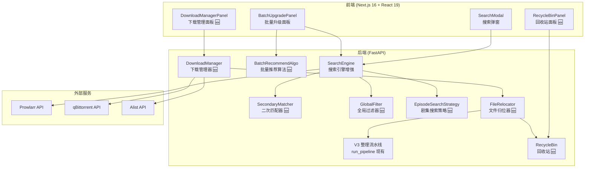
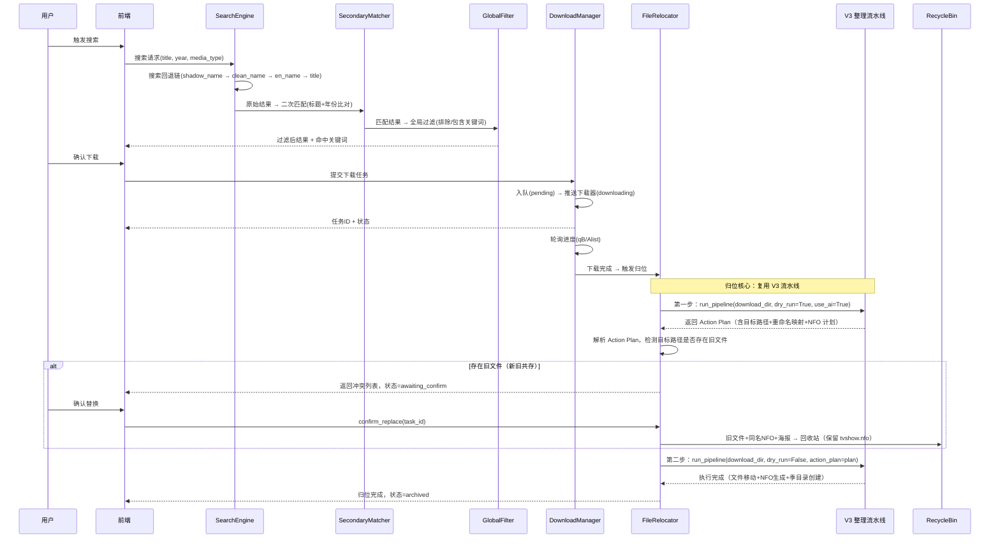

# 设计文档：搜索下载优化 (search-download)

## 概述

本设计文档覆盖 NAS 影视媒体库管理工具在搜索展示、剧集搜索策略、批量搜索推荐和下载生命周期管理四个维度的功能增强。核心目标是实现从"搜索 → 匹配过滤 → 智能推荐 → 下载 → 归位 → 替换确认"的完整闭环。

### 设计目标

1. **搜索精准化**：通过搜索回退链 + 二次匹配 + 全局过滤三层机制，大幅提升搜索结果的相关性
2. **剧集搜索智能化**：整季包优先 → 逐集搜索回退 → 同源匹配，最小化下载任务数
3. **批量推荐自动化**：多维度评分算法自动推荐最佳资源，减少手动选择
4. **下载全生命周期**：持久化任务队列 + 进度监控 + 自动归位 + 新旧共存确认替换 + 回收站

### 现有系统分析

**后端现状：**
- `searcher.py`：`enhanced_search` 已支持多关键词搜索 + 索引器优先级 + 综合排序，但缺少二次匹配和全局过滤
- `quality_parser.py`：`parse_quality` 解析分辨率/来源/编码/字幕，但缺少发布组（release_group）提取
- `downloader.py`：`QBittorrentClient.add_torrent` 和 `AlistManager.transfer_link` 仅做单次推送，无任务队列和进度追踪
- `search_query_builder.py`：`build_bt_queries` 构造搜索词，但未集成影子名优先策略

**前端现状：**
- `SearchModal.tsx`：单条结果平铺展示，无分组、无结构化多行布局
- `BatchUpgradePanel.tsx`：SSE 流式搜索 + 确认 + 批量下载，但评分算法简单（仅 quality_rank + seeders）
- `FilterBar.tsx`：前端本地筛选，未对接后端全局过滤规则

## 架构

### 系统架构总览



### 数据流



## 组件与接口

### 1. QualityParser 增强（需求 1.4）

在现有 `quality_parser.py` 的 `QualityTag` 中新增 `release_group` 字段。

```python
# quality_parser.py — QualityTag 新增字段
class QualityTag(BaseModel):
    resolution: str = ""
    source: str = ""
    video_codec: str = ""
    audio_codec: str = ""
    has_chinese_sub: bool = False
    release_group: str = ""   # 🆕 发布组名称
    display: str = ""

def parse_quality(title: str) -> QualityTag:
    # ... 现有解析逻辑 ...
    # 🆕 发布组提取：匹配标题末尾的 -GroupName 或 @GroupName
    release_group = ""
    rg_match = re.search(r'[-@]([A-Za-z0-9]+)\s*$', title.strip())
    if rg_match:
        rg = rg_match.group(1)
        # 排除常见非发布组后缀
        if rg.upper() not in {"MP4", "MKV", "AVI", "SRT", "ASS"}:
            release_group = rg
    # ... 返回 QualityTag 含 release_group ...
```

### 2. SecondaryMatcher — 二次匹配器（需求 4）

新建 `backend/secondary_matcher.py`，对 Prowlarr 原始结果执行标题+年份精确比对。**强制复用 `tmdb_client.parse_filename` 作为唯一解析引擎**，确保全系统解析标准的一致性。

```python
# secondary_matcher.py
from tmdb_client import parse_filename  # 复用 V3 已有的文件名解析器

class SecondaryMatcher:
    """二次匹配器：复用 parse_filename 从 BT 标题中解析信息，与目标媒体比对"""

    def match(
        self,
        result: SearchResult,
        target_titles: list[str],  # 目标媒体的所有标题变体(含别名)
        target_year: str,
        media_type: str = "movie",
    ) -> MatchVerdict:
        """
        返回 MatchVerdict(passed: bool, reason: str)
        - 标题比对：用 parse_filename 从 BT 标题解析出中文名/英文名，
          与 target_titles 模糊匹配(阈值 0.8)
        - 年份比对：电影 ±1 年容差，剧集与任一季年份匹配即通过
        """
        ...

    def _parse_bt_title(self, title: str) -> BTTitleInfo:
        """复用 tmdb_client.parse_filename 解析 BT 标题。
        
        parse_filename 已支持：
        - 中英文名提取
        - 年份提取
        - 季集号提取（含 S01E01、绝对集数、SP 特别篇）
        
        本方法仅做结果适配，不重复实现正则解析。
        """
        parsed = parse_filename(title)
        return BTTitleInfo(
            cn_name=parsed.get("cn_name", ""),
            en_name=parsed.get("en_name", ""),
            year=parsed.get("year", ""),
            season=parsed.get("season", 0),
            episodes=parsed.get("episodes", []),
        )

class MatchVerdict(BaseModel):
    passed: bool
    reason: str = ""

class BTTitleInfo(BaseModel):
    cn_name: str = ""
    en_name: str = ""
    year: str = ""
    season: int = 0
    episodes: list[int] = []
```

### 3. GlobalFilter — 全局过滤器（需求 5）

新建 `backend/global_filter.py`，管理必须包含/严格排除关键词。

```python
# global_filter.py
DEFAULT_EXCLUDES = ["TS", "CAM", "HDTC", "TC", "TELECINE", "HDTS"]

class GlobalFilter:
    """全局质量过滤规则"""

    def __init__(self, config: dict):
        self.must_include: list[str] = config.get("must_include", [])
        self.must_exclude: list[str] = config.get("must_exclude", DEFAULT_EXCLUDES)

    def apply(self, results: list[SearchResult]) -> list[SearchResult]:
        """
        对结果列表执行过滤：
        1. 标题命中任一排除词 → 丢弃
        2. 配置了包含词时，标题未命中任一包含词 → 丢弃
        """
        ...
```

### 4. SearchEngine 增强 — 搜索回退链（需求 3）

改造现有 `searcher.py` 的 `enhanced_search` 函数，集成回退链 + 二次匹配 + 全局过滤。

```python
# searcher.py — enhanced_search 改造
def enhanced_search(
    client: ProwlarrClient,
    title: str,
    aliases: AliasSet,
    year: str = "",
    media_type: str = "",
    indexer_manager: IndexerPriorityManager = None,
    shadow_name: str = "",           # 🆕
    clean_name: str = "",            # 🆕
    global_filter: GlobalFilter = None,  # 🆕
    season_info: dict = None,        # 🆕 剧集搜索时的季信息
) -> EnhancedSearchResponse:
    """
    搜索回退链：
    1. shadow_name（影子名）
    2. clean_name（清洗名）
    3. aliases.en_names[0]（英文原名）
    4. title（TMDB 中文标题）

    每个关键词搜索后执行：
    - SecondaryMatcher 二次匹配
    - GlobalFilter 全局过滤
    - 有效结果 >= 1 则停止回退

    返回 EnhancedSearchResponse 含 hit_keyword 标注命中关键词
    """
    ...

class EnhancedSearchResponse(BaseModel):
    results: list[SearchResult]
    hit_keyword: str = ""        # 实际命中的搜索关键词
    total_raw: int = 0           # Prowlarr 原始结果数
    total_filtered: int = 0      # 过滤后结果数
```

### 5. EpisodeSearchStrategy — 剧集搜索策略（需求 6, 7, 8）

新建 `backend/episode_search.py`，实现整季包搜索 → 逐集搜索回退 → 同源匹配。

```python
# episode_search.py
class EpisodeSearchStrategy:
    """剧集搜索策略：整季包优先 → 逐集回退 → 同源匹配"""

    def search_season(
        self,
        client: ProwlarrClient,
        title: str,
        season_number: int,
        total_episodes: int,
        aliases: AliasSet,
        year: str = "",
        global_filter: GlobalFilter = None,
    ) -> SeasonSearchResult:
        """
        1. 搜索 "title SXX" 整季包
        2. 验证整季包完整性（Prowlarr 文件列表 API）
        3. 无完整整季包 → 逐集搜索 S01E01..S01ENN
        4. 同源匹配：计算发布组覆盖率，优先推荐完整覆盖的发布组
        """
        ...

    def _verify_season_pack(
        self, result: SearchResult, total_episodes: int
    ) -> PackVerification:
        """
        验证整季包完整性 — Bencode 解析机制：
        
        1. 通过 result.download_url 发起 HTTP GET 请求拉取 .torrent 文件流
        2. 使用 bencodepy（或 torrentool）解析 .torrent 的 Bencode 结构
        3. 从 info.files 列表中提取所有文件路径
        4. 过滤出视频文件（.mkv/.mp4/.avi/.ts 等 RMT_MEDIAEXT）
        5. 对每个视频文件名调用 parse_filename 提取集数
        6. 统计不重复的集数总数，与 total_episodes 比对
        
        注意：
        - 不依赖 Prowlarr 的 JSON 响应查文件树（Prowlarr 不提供此信息）
        - 磁力链接（magnet:）无法预先获取 .torrent，标记为 is_magnet=True
        - .torrent 下载超时（5s）或解析失败时，标记为 verified=False
        """
        if result.download_url.startswith("magnet:"):
            return PackVerification(
                verified=False, is_magnet=True, episode_count=0, is_complete=False
            )
        
        try:
            # 拉取 .torrent 文件流
            resp = requests.get(result.download_url, timeout=5)
            torrent = Torrent.from_string(resp.content)
            
            # 提取视频文件并解析集数
            video_episodes = set()
            for f in torrent.files:
                if Path(f.name).suffix.lower() in VIDEO_EXTS:
                    parsed = parse_filename(Path(f.name).name)
                    if parsed.get("episodes"):
                        video_episodes.update(parsed["episodes"])
            
            return PackVerification(
                verified=True,
                episode_count=len(video_episodes),
                is_complete=len(video_episodes) >= total_episodes,
                is_magnet=False,
            )
        except Exception:
            return PackVerification(verified=False, episode_count=0, is_complete=False)
        ...

class PackVerification(BaseModel):
    verified: bool = False
    is_magnet: bool = False
    episode_count: int = 0
    is_complete: bool = False

    def _episode_search(
        self, client, title, season_number, episode_number, ...
    ) -> list[SearchResult]:
        """单集搜索 S01E01 格式"""
        ...

    def _same_source_match(
        self, episode_results: dict[int, list[SearchResult]]
    ) -> SameSourcePlan:
        """同源匹配：选择覆盖率最高的发布组"""
        ...

class SeasonSearchResult(BaseModel):
    season_packs: list[SeasonPackInfo]       # 整季包列表
    episode_results: dict[int, EpisodeResult] # 逐集结果 {集号: 结果}
    recommended_plan: str = "season_pack"     # "season_pack" | "per_episode"
    same_source_plan: SameSourcePlan | None = None

class SeasonPackInfo(BaseModel):
    result: SearchResult
    verified: bool = False
    episode_count: int = 0
    is_complete: bool = False
    is_magnet: bool = False  # 磁力链无法验证

class EpisodeResult(BaseModel):
    status: str  # "found" | "not_found"
    recommended: SearchResult | None = None
    alternatives: list[SearchResult] = []

class SameSourcePlan(BaseModel):
    primary_group: str           # 主推荐发布组
    coverage: float              # 覆盖率 0.0-1.0
    episodes: dict[int, SearchResult]  # 集号 → 选中资源
    missing_episodes: list[int]  # 缺失集数
```

### 6. BatchRecommendAlgo — 批量推荐算法（需求 9）

改造现有 `main.py` 中的 `_select_best_match`，升级为多维度评分。

```python
# batch_recommend.py
class BatchRecommendAlgo:
    """批量搜索推荐算法：多维度加权评分"""

    WEIGHTS = {
        "title_match": 0.30,
        "resolution_upgrade": 0.25,
        "codec_match": 0.15,
        "seeder_health": 0.15,
        "chinese_sub": 0.10,
        "size_reasonable": 0.05,
    }

    def score(
        self,
        result: SearchResult,
        target_title: str,
        current_resolution: str,
        preferred_codec: str = "x265",
    ) -> float:
        """
        计算匹配分数 0.0-1.0：
        - title_match: fuzzy_score(target, result.title)
        - resolution_upgrade: 分辨率提升幅度归一化
        - codec_match: 编码匹配度(x265 > x264 > 其他)
        - seeder_health: min(seeders/50, 1.0)
        - chinese_sub: 1.0 if has_chinese_sub else 0.0
        - size_reasonable: 基于分辨率的合理大小范围评分
        """
        ...

    def recommend(
        self,
        results: list[SearchResult],
        target_title: str,
        current_resolution: str,
        preferred_codec: str = "x265",
    ) -> RecommendResult:
        """返回最佳推荐 + 置信度标记"""
        ...

class RecommendResult(BaseModel):
    best: SearchResult | None = None
    score: float = 0.0
    confidence: str = ""  # "high" (>=0.7) | "medium" (>=0.5) | "low" (<0.5)
    is_upgrade: bool = False  # 分辨率是否有提升
```

### 7. DownloadManager — 下载管理器（需求 12, 13）

新建 `backend/download_manager.py`，持久化任务队列 + 进度监控。

```python
# download_manager.py
import uuid
from datetime import datetime

TASK_FILE = "download_tasks.json"

class DownloadTask(BaseModel):
    id: str = ""                    # UUID
    media_name: str = ""
    download_url: str = ""
    save_path: str = ""            # 最终目标路径（媒体库中的位置）
    download_dir: str = ""         # 🆕 隔离沙盒路径 downloads/{task_id}/
    channel: str = "qb"            # "qb" | "alist"
    downloader_hash: str = ""      # qB torrent hash 或 Alist task ID
    category_hint: str = ""        # 🆕 "movie" | "tv"，传递给 V3 流水线
    status: str = "pending"        # pending|downloading|cloud_done|completed|relocating|awaiting_confirm|archived|failed|lost|unknown
    progress: float = 0.0          # 0.0-1.0
    speed: str = ""                # "12.5 MB/s"
    eta: str = ""                  # "00:15:30"
    phase: str = ""                # Alist: "cloud_download" | "local_sync"
    error: str = ""
    is_season_pack: bool = False
    season_number: int = 0
    created_at: str = ""
    updated_at: str = ""

class DownloadManager:
    """下载任务队列管理器"""

    # 下载沙盒根目录，每个任务在此下创建独立子目录
    SANDBOX_ROOT = "downloads"

    def __init__(self, qb_client, alist_client, base_path: str):
        self.qb = qb_client
        self.alist = alist_client
        self.base_path = base_path  # NAS 根路径
        self.tasks: list[DownloadTask] = []
        self._load()

    def _create_sandbox(self, task_id: str) -> str:
        """
        为每个下载任务创建隔离沙盒目录：{base_path}/{SANDBOX_ROOT}/{task_id}/
        
        设计理由：
        - 避免多个并行下载任务的文件互相干扰
        - FileRelocator 调用 V3 流水线时，path 指向此沙盒，
          V3 只处理该沙盒内的文件，不会误伤其他任务
        - 归位完成后沙盒目录自动清理
        """
        sandbox_dir = os.path.join(self.base_path, self.SANDBOX_ROOT, task_id)
        os.makedirs(sandbox_dir, exist_ok=True)
        return sandbox_dir

    def submit(self, task: DownloadTask) -> DownloadTask:
        """
        提交新任务：
        1. 生成 UUID 作为 task_id
        2. 创建隔离沙盒 downloads/{task_id}/
        3. 推送下载器时指定 save_path 为沙盒路径
        4. 状态：pending → downloading
        """
        ...

    def sync_progress(self):
        """轮询所有 downloading 任务的进度"""
        ...

    def _sync_qb_progress(self, task: DownloadTask):
        """通过 qBittorrent API 获取进度"""
        ...

    def _sync_alist_progress(self, task: DownloadTask):
        """通过 Alist API 获取进度，区分云端下载/本地同步两阶段"""
        ...

    def on_startup(self):
        """服务启动时：加载队列，同步 downloading 任务的实际状态"""
        ...

    def get_tasks(self, status: str = None) -> list[DownloadTask]:
        """查询任务列表，支持按状态过滤"""
        ...

    def _load(self): ...
    def _save(self): ...
```

### 8. FileRelocator — 文件归位器（需求 14, 15, 16）

新建 `backend/file_relocator.py`。**核心设计原则：FileRelocator 不实现任何文件名解析或重命名逻辑，而是作为 V3 整理流水线的客户端，复用 `run_pipeline`（即 `/organize/full` 的内部实现）完成所有解析、重命名、NFO 生成和季目录创建。**

#### 设计理由

V3 整理流水线已具备：
- Step 0: 散落视频基础封装
- Step 2: classify_folder 分析判定（category_hint + folder_type）
- Step 3: TMDB 刮削确权 + 绝对集数映射 + 精准 NFO 生成
- Step 4: reorganize_seasons_by_nfo（依据 NFO 创建季目录并归位）
- Step 5: 影子名生成

FileRelocator 只需要：
1. 将下载目录作为输入传给 V3 流水线
2. 解析 V3 返回的 Action Plan，检测冲突（新旧共存）
3. 在冲突解决后，让 V3 执行落盘

```python
# file_relocator.py
from organizer import run_pipeline  # 复用 V3 整理流水线核心函数

class FileRelocator:
    """文件归位器：作为 V3 整理流水线的客户端，不重复实现解析/重命名逻辑"""

    def __init__(self, recycle_bin: RecycleBin):
        self.recycle_bin = recycle_bin

    def relocate(self, task: DownloadTask) -> RelocateResult:
        """
        归位工作流（两段式，复用 V3 流水线）：

        第一步 — 推演（dry_run=True）：
        1. 以下载目录为输入，调用 run_pipeline(path=download_dir, dry_run=True, use_ai=True)
        2. V3 流水线自动完成：文件名解析(parse_filename) → TMDB 确权 → 
           绝对集数映射 → 季目录规划 → NFO 生成计划 → 影子名计划
        3. 拿到 Action Plan（含每个文件的目标路径和标准命名）
        4. 遍历 Action Plan，检查每个目标路径是否已存在旧文件
        5. 如果存在旧文件 → 标记为新旧共存（awaiting_confirm），返回冲突列表

        第二步 — 执行（dry_run=False）：
        6. 无冲突或冲突已解决后，调用 run_pipeline(path=download_dir, dry_run=False, action_plan=plan)
        7. V3 流水线执行：文件移动 + NFO 写入 + 季目录创建 + 影子名写入
        8. 更新任务状态为 archived
        """
        # 第一步：推演
        plan = run_pipeline(
            path=task.download_dir,
            dry_run=True,
            use_ai=True,
            category_hint=task.category_hint,  # "movie" 或 "tv"
        )

        # 检测冲突
        conflicts = self._detect_conflicts(plan, task.save_path)

        if conflicts:
            return RelocateResult(
                success=False,
                status="awaiting_confirm",
                action_plan=plan,
                coexist_pairs=conflicts,
            )

        # 无冲突，直接执行
        return self._execute_plan(task, plan)

    def confirm_replace(self, task_id: str, plan: dict) -> RelocateResult:
        """
        用户确认替换：
        1. 将旧视频文件 + 同名 .nfo + 海报图片移入回收站
        2. 保留 tvshow.nfo（剧级元数据）不动
        3. 调用 run_pipeline(dry_run=False) 执行归位
        4. V3 流水线会自动生成新的 episode.nfo（含新文件的质量信息）
        """
        task = self._get_task(task_id)
        conflicts = self._get_conflicts(task_id)

        # 旧文件入回收站（保留 tvshow.nfo）
        for pair in conflicts:
            self._recycle_old_files(pair, task_id)

        # 执行 V3 流水线落盘
        return self._execute_plan(task, plan)

    def cancel_replace(self, task_id: str) -> RelocateResult:
        """用户取消替换：新文件（下载目录中的）移入回收站"""
        ...

    def _detect_conflicts(self, plan: dict, target_base: str) -> list[CoexistPair]:
        """
        解析 V3 Action Plan 中的目标路径，
        检查目标目录中是否已存在同名视频文件
        """
        ...

    def _execute_plan(self, task: DownloadTask, plan: dict) -> RelocateResult:
        """调用 run_pipeline(dry_run=False, action_plan=plan) 执行落盘"""
        result = run_pipeline(
            path=task.download_dir,
            dry_run=False,
            action_plan=plan,
        )
        return RelocateResult(
            success=result.get("success", False),
            status="archived",
            action_plan=plan,
            relocated_files=result.get("actions", []),
        )

    def _recycle_old_files(self, pair: CoexistPair, task_id: str):
        """
        将旧文件及其配套元数据移入回收站：
        - 旧视频文件 → 回收站
        - 同名 .nfo（episode.nfo）→ 回收站
        - 同名海报（-poster.jpg/-thumb.jpg）→ 回收站
        - 目标目录下的 movie.nfo → 回收站（电影类型时）
        - 目标目录下的 season.nfo → 回收站（季目录时）
        - tvshow.nfo → 绝对不移动（剧级元数据，跨季共享）
        """
        import os
        old_video = pair.old_file
        base = os.path.splitext(old_video)[0]
        target_dir = os.path.dirname(old_video)

        # 视频文件
        self.recycle_bin.move_to_bin(old_video, task_id)

        # 同名 NFO（episode.nfo，非 tvshow.nfo）
        nfo_path = base + ".nfo"
        if os.path.exists(nfo_path) and not nfo_path.endswith("tvshow.nfo"):
            self.recycle_bin.move_to_bin(nfo_path, task_id)

        # 目录级 NFO：movie.nfo（电影）和 season.nfo（季目录）
        # 绝对不动 tvshow.nfo
        for dir_nfo in ["movie.nfo", "season.nfo"]:
            dir_nfo_path = os.path.join(target_dir, dir_nfo)
            if os.path.exists(dir_nfo_path):
                self.recycle_bin.move_to_bin(dir_nfo_path, task_id)

        # 同名海报
        for suffix in ["-poster.jpg", "-thumb.jpg", "-fanart.jpg"]:
            poster = base + suffix
            if os.path.exists(poster):
                self.recycle_bin.move_to_bin(poster, task_id)

class RelocateResult(BaseModel):
    success: bool
    status: str = ""              # "archived" | "awaiting_confirm" | "failed"
    action_plan: dict = {}        # V3 流水线返回的 Action Plan
    relocated_files: list = []    # 已归位的文件列表
    coexist_pairs: list[CoexistPair] = []  # 新旧共存冲突对

class CoexistPair(BaseModel):
    new_file: str                 # Action Plan 中的目标文件路径
    old_file: str                 # 目标目录中已存在的旧文件路径
    new_size_gb: float
    old_size_gb: float

class ReplaceResult(BaseModel):
    success: bool
    recycled_files: list[str]     # 移入回收站的文件
```

### 9. RecycleBin — 回收站（需求 17）

新建 `backend/recycle_bin.py`。

```python
# recycle_bin.py
class RecycleBinEntry(BaseModel):
    original_path: str
    recycle_path: str
    size_gb: float
    moved_at: str          # ISO datetime
    task_id: str = ""      # 关联的下载任务 ID
    expires_at: str = ""   # 过期时间

class RecycleBin:
    """回收站：存放被替换的旧文件"""

    def __init__(self, recycle_dir: str, retention_days: int = 30):
        self.recycle_dir = recycle_dir
        self.retention_days = retention_days
        self.entries: list[RecycleBinEntry] = []

    def move_to_bin(self, file_path: str, task_id: str = "") -> RecycleBinEntry:
        """将文件移入回收站，记录元数据"""
        ...

    def restore(self, entry_id: str) -> bool:
        """从回收站恢复文件到原始路径"""
        ...

    def cleanup_expired(self) -> int:
        """清理过期文件，返回清理数量"""
        ...

    def list_entries(self) -> list[RecycleBinEntry]:
        """列出回收站所有文件"""
        ...
```

### 10. DownloadChannelRecommender — 下载通道推荐（需求 18）

```python
# download_manager.py 内部方法
class DownloadManager:
    def recommend_channel(self, result: SearchResult) -> str:
        """
        推荐下载通道：
        - seeders >= 5 且 size_gb <= 50 → "qb"
        - seeders < 5 或 size_gb > 50 → "alist"
        - 仅配置一种通道 → 直接使用
        """
        ...
```

### 11. API 接口设计

```python
# main.py 新增/改造 API

# 搜索 API 改造（需求 3, 4, 5）
@app.get("/search")
def search_resources(
    query: str,
    media_type: str = "",
    year: str = "",
    shadow_name: str = "",
    clean_name: str = "",
    season: int = 0,           # 🆕 季号（触发剧集搜索策略）
    total_episodes: int = 0,   # 🆕 总集数
) -> dict: ...

# 下载管理 API（需求 12, 13）
@app.post("/download-manager/submit")
def submit_download(task: DownloadTaskRequest) -> dict: ...

@app.get("/download-manager/tasks")
def get_download_tasks(status: str = None) -> list[DownloadTask]: ...

@app.get("/download-manager/progress")
def get_download_progress() -> list[dict]: ...

# 文件归位 API（需求 15, 16）
@app.post("/download-manager/confirm-replace")
def confirm_replace(task_id: str) -> dict: ...

@app.post("/download-manager/cancel-replace")
def cancel_replace(task_id: str) -> dict: ...

# 回收站 API（需求 17）
@app.get("/recycle-bin")
def list_recycle_bin() -> list[RecycleBinEntry]: ...

@app.post("/recycle-bin/restore")
def restore_from_bin(entry_id: str) -> dict: ...

@app.post("/recycle-bin/cleanup")
def cleanup_recycle_bin() -> dict: ...

# 全局过滤规则 API（需求 5）
@app.get("/config/search-filter")
def get_search_filter() -> dict: ...

@app.post("/config/search-filter")
def save_search_filter(filter_config: dict) -> dict: ...

# 批量搜索改造（需求 9, 10, 11）
@app.post("/batch-search")
async def batch_search(req: BatchSearchRequest) -> StreamingResponse: ...

@app.post("/batch-download")
def batch_download(tasks: list[DownloadTaskRequest]) -> dict: ...
```

### 12. 前端组件设计

#### SearchModal 改造（需求 1, 2, 8）

```
SearchModal
├── 搜索栏 + FilterBar（现有）
├── 分组模式切换（平铺 | 按发布组 | 按索引器）🆕
├── 命中关键词标注 🆕
├── 结果列表
│   ├── 结构化三行布局 🆕
│   │   ├── 第一行：质量标签 + 索引器 + 中字徽章 + ↑更高标识
│   │   ├── 第二行：完整原始标题
│   │   └── 第三行：文件大小 + 做种数 + 发布时间
│   └── 分组折叠（按发布组/索引器）🆕
├── 逐集搜索汇总表格（tv 模式）🆕
│   ├── 集号 | 推荐资源 | 质量 | 大小 | 做种 | 切换备选
│   └── 总大小汇总
└── 下载按钮（含通道推荐标注）🆕
```

#### BatchUpgradePanel 改造（需求 9, 10, 11）

```
BatchUpgradePanel
├── 搜索阶段（现有 SSE 流式）
├── 确认阶段 🆕改造
│   ├── 匹配分数显示 + 低置信度警告色
│   ├── 无提升项默认不勾选
│   ├── 全选推荐（仅 score>=0.5 且有提升）
│   ├── 查看备选（展开完整结果列表）
│   └── 批量下载总大小汇总
├── 下载阶段 → 提交到 DownloadManager
└── 完成阶段（提交结果摘要）
```

#### DownloadManagerPanel 新增（需求 12, 13）

```
DownloadManagerPanel
├── 任务列表（按创建时间倒序）
│   ├── 状态筛选（全部 | 下载中 | 已完成 | 待确认 | 失败）
│   ├── 每项：媒体名 + 状态 + 进度条 + 速度 + ETA
│   └── Alist 双阶段显示（云端下载中 / 同步中）
├── 待确认替换区域
│   ├── 新旧文件对比（名称 + 大小）
│   └── 确认替换 / 取消替换 按钮
└── 回收站入口
```

## 数据模型

### 配置扩展

```json
// config.json 新增字段
{
  "search_filter": {
    "must_include": [],
    "must_exclude": ["TS", "CAM", "HDTC", "TC", "TELECINE", "HDTS"]
  },
  "recycle_bin_path": "",
  "recycle_bin_retention_days": 30,
  "preferred_codec": "x265",
  "download_channel_auto": true
}
```

### 下载任务持久化

```json
// download_tasks.json
[
  {
    "id": "uuid-xxx",
    "media_name": "沙丘2",
    "download_url": "magnet:?xt=...",
    "save_path": "\\\\DS218play\\share\\视频\\电影\\沙丘2",
    "channel": "qb",
    "downloader_hash": "abc123def",
    "status": "downloading",
    "progress": 0.45,
    "speed": "12.5 MB/s",
    "eta": "00:15:30",
    "phase": "",
    "error": "",
    "is_season_pack": false,
    "season_number": 0,
    "created_at": "2024-01-15T10:30:00",
    "updated_at": "2024-01-15T10:45:00"
  }
]
```

### 回收站元数据

```json
// recycle_bin.json
[
  {
    "id": "uuid-yyy",
    "original_path": "\\\\DS218play\\share\\视频\\电影\\沙丘2\\Dune.Part.Two.2024.1080p.mkv",
    "recycle_path": "\\\\DS218play\\share\\回收站\\uuid-yyy_Dune.Part.Two.2024.1080p.mkv",
    "size_gb": 8.5,
    "moved_at": "2024-01-15T11:00:00",
    "task_id": "uuid-xxx",
    "expires_at": "2024-02-14T11:00:00"
  }
]
```

### 搜索结果扩展类型

```typescript
// types/index.ts 新增/扩展
interface QualityTag {
  resolution: string;
  source: string;
  video_codec: string;
  audio_codec: string;
  has_chinese_sub: boolean;
  release_group: string;  // 🆕
  display: string;
}

interface EnhancedSearchResult extends SearchResult {
  quality: QualityTag;
  quality_rank: number;
  match_verdict?: "matched" | "unmatched";  // 🆕 二次匹配结果
  publish_date?: string;  // 🆕 发布时间
}

interface SearchResponse {
  results: EnhancedSearchResult[];
  hit_keyword: string;      // 🆕 命中的搜索关键词
  total_raw: number;        // 🆕 原始结果数
  total_filtered: number;   // 🆕 过滤后结果数
}

// 剧集搜索结果
interface SeasonSearchResponse {
  season_packs: SeasonPackInfo[];
  episode_results: Record<number, EpisodeResult>;
  recommended_plan: "season_pack" | "per_episode";
  same_source_plan?: SameSourcePlan;
}

// 下载任务
interface DownloadTask {
  id: string;
  media_name: string;
  status: string;
  progress: number;
  speed: string;
  eta: string;
  phase: string;
  channel: string;
  created_at: string;
  coexist_pairs?: CoexistPair[];
}

// 回收站条目
interface RecycleBinEntry {
  id: string;
  original_path: string;
  size_gb: number;
  moved_at: string;
  expires_at: string;
}
```

## 正确性属性

*正确性属性是一种在系统所有有效执行中都应成立的特征或行为——本质上是对系统应做什么的形式化陈述。属性是人类可读规范与机器可验证正确性保证之间的桥梁。*

### 属性 1：发布组提取正确性

*对于任意*包含 `-GroupName` 或 `@GroupName` 后缀的 BT 标题字符串，`parse_quality` 返回的 `release_group` 字段应等于该后缀中的组名；对于不包含发布组后缀的标题，`release_group` 应为空字符串。

**验证需求：1.4**

### 属性 2：搜索结果分组正确性

*对于任意*搜索结果列表和分组模式（"按发布组"或"按索引器"），分组函数的输出应满足：(a) 同一组内所有结果的分组键（release_group 或 indexer）相同，(b) 所有结果恰好出现在一个组中（不丢失、不重复），(c) 分组键为空的结果归入"其他"组。

**验证需求：2.2, 2.3, 2.4**

### 属性 3：搜索回退链优先级与停止

*对于任意*搜索回退链（shadow_name → clean_name → en_name → title）和模拟的 Prowlarr 搜索结果，搜索引擎应按优先级依次尝试关键词，在首个返回有效结果（经二次匹配后 >= 1 条）的关键词处停止，且返回的 `hit_keyword` 等于该关键词。

**验证需求：3.1, 3.2, 3.3, 3.5**

### 属性 4：二次匹配过滤正确性

*对于任意* BT 搜索结果和目标媒体信息（标题列表 + 年份），经过二次匹配后的结果集应仅包含标题匹配（BT 标题中的中英文名至少有一个在目标标题/别名列表中模糊匹配通过）的结果，不匹配的结果应被完全剔除。

**验证需求：4.1, 4.3, 4.4**

### 属性 5：年份容差规则

*对于任意*电影类型的目标年份 Y 和 BT 结果年份 R，当 |Y - R| <= 1 时匹配应通过，当 |Y - R| > 1 时匹配应失败。*对于任意*剧集类型的目标季年份列表和 BT 结果年份，当结果年份与任一季年份匹配时应通过。

**验证需求：4.2**

### 属性 6：全局过滤规则正确性

*对于任意*搜索结果列表和过滤规则（排除词列表 + 包含词列表），过滤后的结果应满足：(a) 没有任何结果的标题包含排除词列表中的任一词，(b) 当包含词列表非空时，所有结果的标题至少包含包含词列表中的一个词。

**验证需求：5.2, 5.3**

### 属性 7：整季包识别与回退

*对于任意* tv 类型媒体的季级搜索，搜索引擎应首先使用 "标题 SXX" 格式搜索；当搜索结果中存在包含全部集数的资源时，该资源应被标记为"整季包"；当无完整整季包时，应自动切换为逐集搜索模式。

**验证需求：6.1, 6.2, 6.3**

### 属性 8：整季包完整性验证

*对于任意*种子文件列表（含视频文件名列表）和目标季总集数，当解析出的视频文件数量 < 总集数时，该资源应被降级标记为"不完整包"；当视频文件数量 >= 总集数时，应标记为完整整季包。

**验证需求：6.6, 6.7**

### 属性 9：同源匹配覆盖率计算与推荐

*对于任意*多集搜索结果（每集有多个来自不同发布组的候选），同源匹配算法应正确计算每个发布组的集数覆盖率（覆盖集数 / 总集数），且推荐的主发布组应是覆盖率最高的那个。

**验证需求：7.1, 7.2, 7.3**

### 属性 10：逐集搜索格式与汇总

*对于任意*季号 S 和总集数 N，逐集搜索应生成 N 个搜索查询，每个查询包含 "S{SS}E{EE}" 格式的集号标识；汇总结果应包含 N 个条目，每个条目的状态为 "found" 或 "not_found"。

**验证需求：8.1, 8.2**

### 属性 11：批量推荐评分范围与置信度标记

*对于任意*搜索结果和目标媒体信息，批量推荐算法的评分应在 [0.0, 1.0] 范围内；当评分 < 0.5 时应标记为"低置信度"；当结果分辨率未高于当前分辨率时应标记为"无提升"。

**验证需求：9.2, 9.3, 9.4**

### 属性 12：全选推荐逻辑

*对于任意*批量搜索结果列表，"全选推荐"操作应仅勾选匹配分数 >= 0.5 且分辨率有提升的项目，不满足条件的项目不应被勾选。

**验证需求：10.2**

### 属性 13：下载任务持久化 round-trip

*对于任意*下载任务列表，序列化到 JSON 文件后再反序列化加载，应得到与原始列表等价的任务数据（所有字段一致）。

**验证需求：12.1**

### 属性 14：下载任务状态机

*对于任意*新提交的下载任务，初始状态应为 "pending"；推送下载器成功后应转为 "downloading"；推送失败应转为 "failed"。状态转换应严格遵循：pending → downloading → completed → relocating → archived，或 pending → failed。

**验证需求：12.2, 12.3**

### 属性 15：任务队列排序

*对于任意*下载任务队列，查询返回的列表应按创建时间倒序排列（最新的在前）。

**验证需求：12.4**

### 属性 16：启动恢复同步

*对于任意*持久化的任务队列（含 downloading 状态的任务）和下载器的实际状态，启动恢复后：下载器中仍存在的任务应保持 downloading 状态并同步进度，下载器中已不存在的任务应标记为 lost。

**验证需求：12.6**

### 属性 17：Alist 双阶段进度状态

*对于任意* Alist 通道的下载任务，当 Alist 报告云端下载完成但本地同步未开始时，任务状态应为 "cloud_done"；当本地同步完成后，状态应更新为 "completed"。qBittorrent 通道的任务在下载完成时应直接更新为 "completed"。

**验证需求：13.2, 13.3, 13.4**

### 属性 18：V3 流水线 Action Plan 解析与冲突检测

*对于任意* V3 流水线返回的 Action Plan（含目标路径列表）和目标目录的现有文件列表，FileRelocator 的冲突检测应：(a) 正确识别 Action Plan 中每个目标路径在目标目录中是否已存在同名文件，(b) 存在冲突时返回 awaiting_confirm 状态和完整的冲突对列表，(c) 无冲突时直接进入执行阶段。

**验证需求：14.1, 14.2, 16.1**

### 属性 19：字幕文件配对（由 V3 流水线保证）

*对于任意*包含视频文件和字幕文件（.srt/.ass/.ssa）的下载目录，V3 流水线的 Action Plan 应将同集数的字幕文件与视频文件正确配对，配对后的字幕文件应与对应视频文件使用相同的标准命名前缀。FileRelocator 仅验证 Action Plan 中字幕文件的存在性。

**验证需求：14.5**

### 属性 20：文件归位路径正确性（由 V3 流水线保证）

*对于任意*已完成的下载任务，V3 流水线的 Action Plan 应确保：tv 类型归位到 "目标路径/Season XX/" 子目录，movie 类型归位到目标电影文件夹。FileRelocator 调用 run_pipeline(dry_run=False) 后，任务状态应更新为 "archived"。

**验证需求：15.2, 15.3, 15.4**

### 属性 21：新旧文件共存与替换

*对于任意*归位到已有同名媒体目录的新文件：(a) 归位时旧文件不被删除，新旧共存；(b) 用户确认替换时，旧视频文件及其同名 .nfo 和海报移入回收站，但 tvshow.nfo 保留；(c) 用户取消替换时，新文件移入回收站。

**验证需求：16.1, 16.3, 16.4**

### 属性 22：回收站 round-trip

*对于任意*文件，移入回收站后再恢复，文件应回到原始路径；回收站条目应记录正确的原始路径、移入时间和关联任务 ID。

**验证需求：17.2, 17.4**

### 属性 23：回收站过期清理

*对于任意*回收站条目列表和保留天数配置，过期清理应仅删除移入时间超过保留天数的条目，未过期的条目应保留不动。

**验证需求：17.5**

### 属性 24：下载通道推荐规则

*对于任意*搜索结果（含做种数和文件大小），当两种通道均已配置时：做种数 >= 5 且文件大小 <= 50GB 应推荐 qBittorrent，否则推荐 Alist；当仅配置一种通道时，应直接使用该通道。

**验证需求：18.2, 18.3, 18.5**

## 错误处理

### 搜索阶段

| 错误场景 | 处理策略 |
|---------|---------|
| Prowlarr API 不可达 | 返回错误信息，前端显示"搜索服务不可用" |
| 搜索回退链全部无结果 | 返回空结果，标记"未找到资源" |
| 二次匹配全部剔除 | 等同无结果，继续回退链下一个关键词 |
| BT 标题解析失败 | 跳过二次匹配，保留该结果（宁可多不可漏） |
| 整季包文件列表 API 失败 | 标注"集数未验证"，不降级 |

### 下载阶段

| 错误场景 | 处理策略 |
|---------|---------|
| qBittorrent 推送失败 | 任务标记 failed，记录错误原因 |
| Alist 所有工具均失败 | 任务标记 failed，记录尝试过的工具列表 |
| 下载器 API 不可达（轮询时） | 任务标记 unknown，API 恢复后自动重新同步 |
| 启动时 downloading 任务在下载器中不存在 | 标记 lost，等待用户手动处理 |

### 归位阶段

| 错误场景 | 处理策略 |
|---------|---------|
| V3 流水线 dry_run 返回空 Action Plan | 任务标记 failed，记录"V3 流水线无法识别下载内容" |
| V3 流水线 dry_run 中 TMDB 确权失败 | Action Plan 中对应文件标记为"未识别"，归位时保留原始文件名 |
| V3 流水线执行（dry_run=False）失败 | 任务标记 failed，保留下载目录中的原始文件不动 |
| 目标路径不存在 | V3 流水线自动创建目录（已有能力） |
| 文件移动失败（权限/空间不足） | 任务标记 failed，保留原始文件不动 |
| 旧文件入回收站失败 | 中止归位，返回错误，不执行 V3 落盘 |

### 回收站

| 错误场景 | 处理策略 |
|---------|---------|
| 回收站目录不存在 | 自动创建 |
| 恢复时原始路径已被占用 | 返回错误，提示用户手动处理 |
| 过期清理时文件删除失败 | 记录日志，跳过该文件继续清理 |

## 测试策略

### 属性测试（Property-Based Testing）

使用 Python `hypothesis` 库进行属性测试，前端使用 `fast-check` 库。每个属性测试至少运行 100 次迭代。

#### 后端属性测试

| 属性 | 测试文件 | 标签 |
|------|---------|------|
| 属性 1：发布组提取 | `test_quality_parser_props.py` | Feature: search-download, Property 1: 发布组提取正确性 |
| 属性 3：搜索回退链 | `test_search_engine_props.py` | Feature: search-download, Property 3: 搜索回退链优先级与停止 |
| 属性 4：二次匹配过滤 | `test_secondary_matcher_props.py` | Feature: search-download, Property 4: 二次匹配过滤正确性 |
| 属性 5：年份容差 | `test_secondary_matcher_props.py` | Feature: search-download, Property 5: 年份容差规则 |
| 属性 6：全局过滤 | `test_global_filter_props.py` | Feature: search-download, Property 6: 全局过滤规则正确性 |
| 属性 7：整季包识别与回退 | `test_episode_search_props.py` | Feature: search-download, Property 7: 整季包识别与回退 |
| 属性 8：整季包完整性验证 | `test_episode_search_props.py` | Feature: search-download, Property 8: 整季包完整性验证 |
| 属性 9：同源匹配覆盖率 | `test_episode_search_props.py` | Feature: search-download, Property 9: 同源匹配覆盖率计算与推荐 |
| 属性 10：逐集搜索格式 | `test_episode_search_props.py` | Feature: search-download, Property 10: 逐集搜索格式与汇总 |
| 属性 11：批量推荐评分 | `test_batch_recommend_props.py` | Feature: search-download, Property 11: 批量推荐评分范围与置信度标记 |
| 属性 13：任务持久化 round-trip | `test_download_manager_props.py` | Feature: search-download, Property 13: 下载任务持久化 round-trip |
| 属性 14：任务状态机 | `test_download_manager_props.py` | Feature: search-download, Property 14: 下载任务状态机 |
| 属性 15：任务队列排序 | `test_download_manager_props.py` | Feature: search-download, Property 15: 任务队列排序 |
| 属性 17：Alist 双阶段进度 | `test_download_manager_props.py` | Feature: search-download, Property 17: Alist 双阶段进度状态 |
| 属性 18：V3 Action Plan 冲突检测 | `test_file_relocator_props.py` | Feature: search-download, Property 18: V3 流水线 Action Plan 解析与冲突检测 |
| 属性 19：字幕配对（V3 保证） | `test_file_relocator_props.py` | Feature: search-download, Property 19: 字幕文件配对 |
| 属性 20：文件归位路径（V3 保证） | `test_file_relocator_props.py` | Feature: search-download, Property 20: 文件归位路径正确性 |
| 属性 22：回收站 round-trip | `test_recycle_bin_props.py` | Feature: search-download, Property 22: 回收站 round-trip |
| 属性 23：过期清理 | `test_recycle_bin_props.py` | Feature: search-download, Property 23: 回收站过期清理 |
| 属性 24：下载通道推荐 | `test_download_manager_props.py` | Feature: search-download, Property 24: 下载通道推荐规则 |

#### 前端属性测试

| 属性 | 测试文件 | 标签 |
|------|---------|------|
| 属性 2：分组正确性 | `SearchModal.prop.test.ts` | Feature: search-download, Property 2: 搜索结果分组正确性 |
| 属性 12：全选推荐逻辑 | `BatchUpgradePanel.prop.test.ts` | Feature: search-download, Property 12: 全选推荐逻辑 |

### 单元测试

单元测试聚焦于具体示例、边界情况和集成点：

#### 后端单元测试

- `test_quality_parser.py`：发布组提取的具体示例（常见发布组名如 CMCT、HDHome、CHD）
- `test_secondary_matcher.py`：BT 标题解析的具体示例、年份容差边界（±1 年 vs ±2 年）、标题完全不匹配的情况
- `test_global_filter.py`：默认排除列表验证、空规则行为、大小写不敏感匹配
- `test_episode_search.py`：磁力链接无法验证的标注、缺失集数标记、整季包+逐集同时存在的展示
- `test_download_manager.py`：启动恢复（downloading 任务在下载器中不存在 → lost）、推送失败 → failed
- `test_file_relocator.py`：V3 流水线 dry_run 返回空 Plan 的处理、冲突检测（新旧文件同名）、旧文件入回收站时 tvshow.nfo 保留逻辑、V3 执行失败的回滚
- `test_recycle_bin.py`：恢复时原始路径被占用的错误处理、回收站目录不存在时自动创建

#### 前端单元测试

- `SearchModal.test.tsx`：结构化三行布局渲染验证、中字徽章和升级标识的条件渲染
- `BatchUpgradePanel.test.tsx`：低置信度警告色显示、无提升项默认不勾选、查看备选展开
- `DownloadManagerPanel.test.tsx`：任务列表状态筛选、Alist 双阶段显示、待确认替换区域

### 测试配置

```python
# conftest.py — hypothesis 配置
from hypothesis import settings
settings.register_profile("ci", max_examples=200)
settings.register_profile("dev", max_examples=100)
settings.load_profile("dev")
```

```typescript
// vitest.config.ts — fast-check 配置
// 每个属性测试使用 fc.assert(property, { numRuns: 100 })
```
