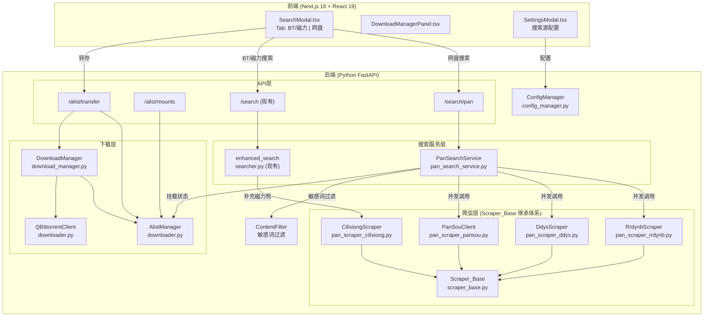
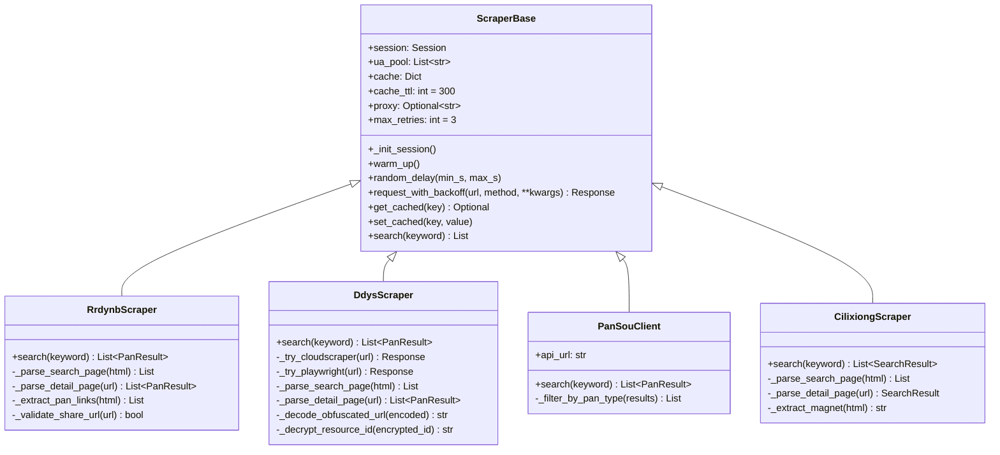
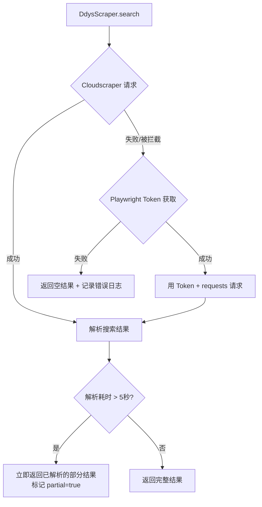

# 设计文档：搜索增强 (search-enhance)

## 概述

本设计文档描述 NAS 影视媒体库管理工具的搜索增强功能的技术架构与实现方案。核心目标是将搜索能力从单一的 Prowlarr BT/磁力搜索扩展为双通道架构：

1. **网盘搜索通道**：rrdynb + ddys + PanSou → Alist 转存（夸克/阿里/百度/115/PikPak）
2. **BT/磁力补充通道**：在现有 Prowlarr 基础上补充磁力熊（cilixiong.org）直搜源

设计遵循以下架构原则：
- **底层解耦，接口统一**：所有爬虫继承 `Scraper_Base`，强制使用内置的 random_delay、UA_pool 和 exponential_backoff；所有网盘搜索源输出严格映射到 `Pan_Result` 模型
- **ddys.io 攻坚重点**：优先 Cloudscraper → 降级 Playwright Token 获取 → 超时 5 秒异步返回不阻塞
- **Alist 状态前置校验**：实时比对挂载状态，同盘秒传 vs 跨盘离线自动判定

## 架构

### 系统架构图




### Scraper_Base 继承体系



### ddys.io 降级策略流程



### Alist 转存判定流程

```mermaid
flowchart TD
    A[用户点击转存] --> B[获取 share_url 的 pan_type]
    B --> C[查询 Alist mount_status 缓存]
    C --> D{目标挂载的 pan_type == share_url 的 pan_type?}
    D -->|是: 同盘转存| E[调用 Alist 同盘转存 API<br/>标记为"秒传"类型]
    D -->|否: 跨盘转存| F[调用 Alist 离线下载 API<br/>标记为"异步离线"类型]
    E --> G[任务纳入 DownloadManager]
    F --> G
    G --> H[前端显示任务状态]
```

## 组件与接口

### 新增文件

| 文件 | 职责 |
|------|------|
| `backend/scraper_base.py` | 爬虫基类：random_delay、UA 轮换池、指数退避重试、结果缓存、代理池支持 |
| `backend/pan_scraper_rrdynb.py` | 人人电影网爬虫：帝国 CMS POST 搜索 → 详情页网盘链接提取 |
| `backend/pan_scraper_ddys.py` | 低端影视爬虫：Cloudscraper/Playwright 降级 → 混淆 URL 还原 |
| `backend/pan_scraper_pansou.py` | PanSou API 客户端：`/api/search` 调用 → 按网盘类型过滤 |
| `backend/pan_scraper_cilixiong.py` | 磁力熊爬虫：搜索 + 详情页磁力链接提取 |
| `backend/pan_search_service.py` | 网盘搜索聚合服务：并发调用、去重、分组、挂载状态标记 |

### 修改文件

| 文件 | 修改内容 |
|------|----------|
| `backend/downloader.py` | AlistManager 扩展：挂载状态缓存、pan_type→驱动映射、同盘转存 API、错误码映射 |
| `backend/download_manager.py` | DownloadTask 新增 `task_type` 字段（bt/transfer）、转存任务提交与状态同步 |
| `backend/searcher.py` | enhanced_search 集成 CilixiongScraper、按 btih 去重、磁力熊标识 |
| `backend/config_manager.py` | AppConfig 新增搜索源开关、PanSou API 地址、网盘优先级、代理池、敏感词列表 |
| `backend/main.py` | 新增 `/search/pan`、`/alist/mounts`、`/alist/transfer` 路由 |
| `frontend/components/search/SearchModal.tsx` | Tab 切换改造、网盘结果卡片、转存按钮、挂载状态标记 |
| `frontend/components/settings/SettingsModal.tsx` | 搜索源开关、PanSou 地址、网盘优先级、代理池、敏感词配置 |

### 核心接口定义

#### Scraper_Base（爬虫基类）

```python
class ScraperBase:
    """所有爬虫的基类，强制使用内置的反爬能力"""

    def __init__(self, proxy: Optional[str] = None):
        self.session: requests.Session   # 会话持久化（自动维护 Cookie/Token）
        self.ua_pool: List[str]          # 10+ 常见浏览器 UA
        self._cache: Dict[str, tuple]    # {keyword: (timestamp, results)}
        self.cache_ttl: int = 300        # 5 分钟
        self.proxy: Optional[str] = proxy
        self.max_retries: int = 3

    def _init_session(self) -> None:
        """初始化持久化会话：设置 UA、代理、默认 headers。
        子类可覆写此方法实现站点特定的预热逻辑（如先请求首页获取 Cookie/Token）。"""

    def warm_up(self) -> None:
        """会话预热：请求目标站点首页，获取必要的 Cookie/Token。
        默认空实现，ddys 等需要预热的站点覆写此方法。"""

    def random_delay(self, min_s: float = 1.0, max_s: float = 2.0) -> None:
        """请求间随机延迟"""

    def request_with_backoff(self, url: str, method: str = "GET", **kwargs) -> requests.Response:
        """带指数退避的 HTTP 请求（429/503/超时自动重试，退避 2s/4s/8s）。
        使用 self.session 发送请求，自动携带 Cookie。"""

    def get_cached(self, key: str) -> Optional[List]:
        """获取缓存结果（TTL 内有效）"""

    def set_cached(self, key: str, value: List) -> None:
        """设置缓存"""

    def search(self, keyword: str) -> List:
        """子类必须实现的搜索方法"""
        raise NotImplementedError
```

#### PanSearchService（网盘搜索聚合服务）

```python
class PanSearchService:
    """网盘搜索聚合服务：并发调用多源、去重、分组、挂载状态标记"""

    def __init__(self, config: AppConfig, alist_manager: AlistManager):
        self.scrapers: Dict[str, ScraperBase]  # 已启用的爬虫实例
        self.alist_manager = alist_manager
        self.content_filter = ContentFilter(config)

    async def search(self, keyword: str) -> PanSearchResponse:
        """
        1. 并发调用所有已启用的爬虫
        2. 合并结果，按 share_url 去重
        3. 敏感词过滤
        4. 按网盘类型分组（夸克 > 阿里 > 115 > PikPak > 百度）
        5. 标记各结果的 mounted 状态
        6. 返回聚合响应（含各源状态）
        """

    def _deduplicate(self, results: List[PanResult]) -> List[PanResult]:
        """双重去重：
        1. 按 share_url 精确去重
        2. 标题规范化去重：Levenshtein 相似度 > 0.9 且同 pan_type 的结果折叠"""

    def _group_by_pan_type(self, results: List[PanResult]) -> Dict[str, List[PanResult]]:
        """按网盘类型分组并排序"""
```

#### AlistManager 扩展接口

```python
# downloader.py 中 AlistManager 新增方法

class AlistManager:
    # --- 现有方法保留 ---
    def get_accounts(self) -> List[AlistAccount]: ...
    def transfer_link(self, download_url: str, remote_path: str) -> bool: ...

    # --- 新增方法 ---
    def get_mount_status(self) -> Dict[str, MountInfo]:
        """启动时调用 /api/admin/storage/list 动态构建 pan_type → 驱动映射。
        不硬编码驱动名称，而是从 Alist 实时返回的 driver 字段反向匹配 pan_type。"""

    def refresh_mount_cache(self) -> None:
        """定时刷新挂载缓存（5 分钟间隔），重新调用 Alist API 更新动态映射表"""

    def is_mounted(self, pan_type: str) -> bool:
        """检查指定网盘类型是否已挂载"""

    def get_mount_path(self, pan_type: str) -> Optional[str]:
        """获取指定网盘类型的挂载路径"""

    def check_local_cache_space(self, min_gb: float = 5.0) -> bool:
        """校验 NAS 本地缓存盘剩余空间。
        跨盘转存时 Alist 会先下载到本地临时目录再传到目标盘，
        必须确保本地有足够空间，否则拒绝跨盘转存并返回明确错误。"""

    def transfer_pan_share(self, share_url: str, password: str, pan_type: str, save_path: str) -> TransferResult:
        """
        网盘分享链接转存：
        - 同盘转存（pan_type == 目标挂载类型）→ 秒传
        - 跨盘转存 → 先 check_local_cache_space()，通过后调用离线下载
        返回 TransferResult 含 task_id、transfer_type（instant/async）、error_code
        """

    def _map_error_code(self, alist_response: dict) -> str:
        """Alist 错误码映射：空间不足/同名冲突/链接失效/提取码错误"""
```

#### 新增 API 路由

```python
# main.py 新增路由

@app.get("/search/pan")
async def search_pan(keyword: str) -> PanSearchResponse:
    """网盘搜索聚合接口"""

@app.get("/alist/mounts")
def get_alist_mounts() -> List[MountInfo]:
    """获取 Alist 已挂载网盘列表"""

@app.post("/alist/transfer")
def transfer_pan_resource(req: TransferRequest) -> TransferResponse:
    """网盘资源转存接口"""
```


## 数据模型

### Pan_Result（网盘搜索结果 — 统一 Schema）

```python
class PanType(str, Enum):
    QUARK = "quark"       # 夸克
    ALIYUN = "aliyun"     # 阿里
    BAIDU = "baidu"       # 百度
    PAN115 = "pan115"     # 115
    PIKPAK = "pikpak"     # PikPak
    UNKNOWN = "unknown"   # 未识别

class PanResult(BaseModel):
    """所有网盘搜索源的统一输出格式 — 严禁在 Service 层处理非标准字段"""
    title: str                          # 资源标题
    clean_title: str = ""               # 标准化后的标题（去站点水印/乱码）
    pan_type: PanType                   # 网盘类型枚举
    share_url: str                      # 分享链接
    password: str = ""                  # 提取码（可为空）
    source: str                         # 来源站点标识（rrdynb/ddys/pansou）
    mounted: bool = True                # Alist 中是否已挂载该网盘类型
    resolution: str = ""                # 分辨率标签（4K/2160p/1080p/720p/unknown）
    size_gb: float = 0.0                # 资源大小（GB），0 表示未知
    is_complete: bool = True            # 是否完整资源（整季/全集），False 表示碎片集
    file_count: int = 0                 # 文件数量（0 表示未知）
    alive: bool = True                  # 链接存活状态（预检后标记）

    # 合法网盘域名白名单（防止爬虫抓到推广跳转链接）
    VALID_PAN_DOMAINS = [
        "pan.quark.cn", "drive.quark.cn",
        "www.alipan.com", "www.aliyundrive.com",
        "pan.baidu.com",
        "115.com", "anxia.com",
        "mypikpak.com",
    ]

    @validator("share_url")
    def validate_share_url(cls, v):
        if not v or not v.startswith("http"):
            raise ValueError("share_url 无效")
        # 域名合法性校验：只允许已知网盘域名
        from urllib.parse import urlparse
        domain = urlparse(v).netloc
        if not any(d in domain for d in cls.VALID_PAN_DOMAINS):
            raise ValueError(f"share_url 域名不在白名单: {domain}")
        return v
```

### PanSearchResponse（网盘搜索聚合响应）

```python
class SourceStatus(BaseModel):
    """单个搜索源的状态"""
    name: str                           # 源名称
    status: str                         # "success" | "failed" | "disabled" | "timeout"
    count: int = 0                      # 该源返回的结果数
    error: str = ""                     # 错误信息

class PanSearchResponse(BaseModel):
    """网盘搜索聚合响应"""
    results: List[PanResult] = []       # 去重后的结果列表
    groups: Dict[str, List[PanResult]] = {}  # 按 pan_type 分组
    source_statuses: List[SourceStatus] = []  # 各源状态
    total: int = 0                      # 总结果数
```

### MountInfo（Alist 挂载信息）

```python
# pan_type → Alist 驱动关键词映射（用于反向匹配，非硬编码驱动名）
# 启动时从 /api/admin/storage/list 动态构建实际映射表
PAN_TYPE_DRIVER_KEYWORDS = {
    PanType.QUARK: ["quark", "夸克"],
    PanType.ALIYUN: ["aliyun", "阿里"],
    PanType.BAIDU: ["baidu", "百度"],
    PanType.PAN115: ["115"],
    PanType.PIKPAK: ["pikpak"],
}

class MountInfo(BaseModel):
    """Alist 挂载状态信息（动态从 Alist API 获取，不硬编码驱动名称）"""
    pan_type: PanType                   # 网盘类型（通过关键词反向匹配）
    driver: str                         # Alist 实际驱动名称（从 API 获取）
    mount_path: str                     # 挂载路径（如 /Quark）
    status: str                         # "work" | "disabled" | "error"
```

### TransferRequest / TransferResult（转存请求与结果）

```python
class TransferRequest(BaseModel):
    """转存请求"""
    share_url: str                      # 分享链接
    password: str = ""                  # 提取码
    pan_type: str                       # 网盘类型
    save_path: str                      # 目标保存路径

class TransferResult(BaseModel):
    """转存结果"""
    success: bool
    task_id: str = ""                   # DownloadManager 任务 ID
    transfer_type: str = ""             # "instant"（同盘秒传）| "async"（跨盘离线）
    error_code: str = ""                # 空间不足/同名冲突/链接失效/提取码错误/本地缓存不足/重复任务
    error_message: str = ""             # 用户可读的错误提示
```

### DownloadTask 扩展

```python
class DownloadTask(BaseModel):
    # --- 现有字段保留 ---
    id: str = ""
    media_name: str = ""
    download_url: str = ""
    save_path: str = ""
    download_dir: str = ""
    channel: str = "qb"               # "qb" | "alist"
    downloader_hash: str = ""
    category_hint: str = ""
    status: str = "pending"
    progress: float = 0.0
    speed: str = ""
    eta: str = ""
    phase: str = ""
    error: str = ""
    is_season_pack: bool = False
    season_number: int = 0
    created_at: str = ""
    updated_at: str = ""

    # --- 新增字段 ---
    task_type: str = "bt"              # "bt"（BT下载）| "transfer"（网盘转存）
    transfer_type: str = ""            # "instant"（同盘秒传）| "async"（跨盘离线）
    pan_type: str = ""                 # 网盘类型（仅 transfer 类型使用）
    share_url: str = ""                # 原始分享链接（仅 transfer 类型使用）
    password: str = ""                 # 提取码（仅 transfer 类型使用）
    transfer_id: str = ""              # 基于 share_url 的唯一标识（sha256(share_url)[:12]），防重复提交
```

### AppConfig 扩展

```python
class AppConfig(BaseModel):
    # --- 现有字段保留 ---
    # ...

    # --- 搜索增强新增字段 ---
    search_sources: Dict[str, bool] = {
        "rrdynb": True,
        "ddys": True,
        "pansou": False,               # 默认禁用，需用户配置 API 地址
        "cilixiong": True,
    }
    pansou_api_url: str = ""            # PanSou 自部署地址
    pan_type_priority: List[str] = [    # 网盘类型优先级排序
        "quark", "aliyun", "pan115", "pikpak", "baidu"
    ]
    scraper_proxy: str = ""             # 爬虫代理池地址（可选）
    sensitive_words: List[str] = []     # 敏感词列表
```

### ContentFilter（敏感词过滤器）

```python
class ContentFilter:
    """敏感词过滤器 — 后端过滤不合适的搜索结果"""

    def __init__(self, config: AppConfig):
        self.words: List[str] = config.sensitive_words

    def filter(self, results: List[PanResult]) -> List[PanResult]:
        """过滤命中敏感词的结果"""
        return [r for r in results if not self._contains_sensitive(r.title)]

    def _contains_sensitive(self, text: str) -> bool:
        text_lower = text.lower()
        return any(w.lower() in text_lower for w in self.words)
```


## 前端组件设计

### SearchModal Tab 改造

```
SearchModal.tsx 结构变更：

┌─────────────────────────────────────────────┐
│  搜索框 [关键词输入]              [搜索按钮]  │
├──────────────┬──────────────────────────────┤
│ [BT/磁力] Tab │ [网盘] Tab                   │
├──────────────┴──────────────────────────────┤
│                                             │
│  BT/磁力 Tab（现有 + 磁力熊补充）：           │
│  ┌─────────────────────────────────────┐    │
│  │ 标题 | 大小 | 索引器 | 做种 | 操作   │    │
│  │ ...（现有 Prowlarr 结果）            │    │
│  │ ...（磁力熊结果，索引器显示"磁力熊"） │    │
│  └─────────────────────────────────────┘    │
│                                             │
│  网盘 Tab（新增）：                          │
│  ┌─ 夸克 ──────────────────────────────┐    │
│  │ [夸克蓝标签] 标题 | 来源 | [转存]    │    │
│  │ [夸克蓝标签] 标题 | 来源 | [转存]    │    │
│  ├─ 阿里 ──────────────────────────────┤    │
│  │ [阿里橙标签] 标题 | 来源 | [转存]    │    │
│  ├─ 115 ───────────────────────────────┤    │
│  │ [115紫标签] 标题 | 来源 | [转存]     │    │
│  ├─ PikPak ────────────────────────────┤    │
│  │ [PikPak红标签] 标题 | 来源 | [转存]  │    │
│  ├─ 百度（未挂载）─────────────────────┤    │
│  │ [百度灰标签] 标题 | 来源 | [置灰]    │    │
│  └─────────────────────────────────────┘    │
│                                             │
│  搜索源状态栏：rrdynb ✓ | ddys ✗ | pansou ○ │
└─────────────────────────────────────────────┘
```

### 前端状态管理

```typescript
// SearchModal 新增状态
interface PanSearchState {
  panResults: PanResult[];              // 网盘搜索结果
  panGroups: Record<string, PanResult[]>; // 按网盘类型分组
  sourceStatuses: SourceStatus[];       // 各源状态
  panLoading: boolean;                  // 网盘搜索加载中
  activeTab: "bt" | "pan";             // 当前激活的 Tab
  panCache: Record<string, PanSearchResponse>; // 按关键词缓存网盘结果
}

// 网盘搜索结果类型
interface PanResult {
  title: string;
  pan_type: "quark" | "aliyun" | "baidu" | "pan115" | "pikpak" | "unknown";
  share_url: string;
  password: string;
  source: string;
  mounted: boolean;
}

// 网盘类型颜色映射
const PAN_TYPE_COLORS: Record<string, string> = {
  quark: "text-blue-400 bg-blue-400/10",      // 夸克 — 蓝色
  aliyun: "text-orange-400 bg-orange-400/10",  // 阿里 — 橙色
  baidu: "text-green-400 bg-green-400/10",     // 百度 — 绿色
  pan115: "text-purple-400 bg-purple-400/10",  // 115 — 紫色
  pikpak: "text-red-400 bg-red-400/10",        // PikPak — 红色
  unknown: "text-gray-400 bg-gray-400/10",     // 未知 — 灰色
};

// 网盘类型中文名映射
const PAN_TYPE_LABELS: Record<string, string> = {
  quark: "夸克", aliyun: "阿里", baidu: "百度",
  pan115: "115", pikpak: "PikPak", unknown: "未知",
};
```

### SettingsModal 搜索源配置区域

```
设置弹窗新增"搜索源"配置区：

┌─ 搜索源配置 ────────────────────────────────┐
│                                             │
│  搜索源开关：                                │
│  [✓] 人人电影网 (rrdynb)                     │
│  [✓] 低端影视 (ddys)                         │
│  [ ] PanSou（需配置 API 地址）               │
│  [✓] 磁力熊 (cilixiong)                     │
│                                             │
│  PanSou API 地址：[________________]         │
│                                             │
│  网盘优先级（拖拽排序）：                     │
│  1. 夸克  2. 阿里  3. 115  4. PikPak  5. 百度│
│                                             │
│  代理地址（可选）：[________________]         │
│                                             │
│  敏感词列表：[________________] [+添加]      │
│                                             │
└─────────────────────────────────────────────┘
```

## 资源过滤与质量控制

### 三项硬指标校验（PanSearchService 聚合时执行）

```python
class PanResultFilter:
    """网盘搜索结果质量过滤器 — 在聚合去重后、返回前端前执行"""

    # 枪版关键词（命中即丢弃）
    CAM_KEYWORDS = ["TS", "TC", "HC", "CAM", "HDTS", "HDTC", "枪版"]

    def filter(self, results: List[PanResult], media_type: str = "") -> List[PanResult]:
        """三项硬指标过滤：分辨率 + 体积 + 整季判定"""
        return [r for r in results
                if self._check_resolution(r)
                and self._check_size(r, media_type)
                and self._check_completeness(r, media_type)]

    def _check_resolution(self, r: PanResult) -> bool:
        """分辨率强校验：低于 720p 或含枪版关键词 → 丢弃"""
        # 从标题解析分辨率（复用 quality_parser 逻辑）
        # resolution < 720 → False
        # 标题含 CAM_KEYWORDS → False

    def _check_size(self, r: PanResult, media_type: str) -> bool:
        """体积区间控制：
        - 整季资源总大小 < 2GB → 画质极差，丢弃
        - 单次转存前比对本地磁盘剩余空间（在转存时校验，此处仅标记）"""

    def _check_completeness(self, r: PanResult, media_type: str) -> bool:
        """整季判定：
        - 标题含"第X集/EPxx"但不含"全集/完结/Sxx/整季" → 碎片资源，丢弃
        - 确保转存即整季"""
```

### 链接存活预检

```python
# ScraperBase 新增方法
def fast_check_url(self, url: str, timeout: float = 3.0) -> bool:
    """对 share_url 执行 HEAD 请求快速预检。
    失效链接（404/403/超时）返回 False，聚合时剔除。
    注意：仅对最终结果执行，不对中间结果逐条检查（性能考虑）。"""
```

### 语义化重命名

```python
class PanTitleStandardizer:
    """网盘资源标题标准化 — 转存归位时重命名"""

    def standardize(self, raw_title: str, cn_name: str, year: str,
                    season: str = "") -> str:
        """强制格式：中文名 (年份) S0x
        示例：流浪地球 (2023) S01
        - 去除站点水印（www.xxx.com_）
        - 去除乱码后缀
        - 解决 Windows 路径过长问题"""
```

### 归位安全策略（SMB 环境）

```
归位流程（Windows SMB）：
1. 检查目标路径是否已存在同名文件夹
2. 若存在 → 重命名旧文件夹为 {name}.tmp
3. 移动新资源到目标路径
4. 移动成功 → 物理删除 .tmp 旧文件夹
5. 移动失败 → 恢复 .tmp 为原名，报错

跨盘转存完成后：
- 强制触发 Alist 临时目录清理
- 防止 PC 系统盘被缓存文件挤爆
```

### 磁力去重增强

```
去重策略（双层）：
1. 哈希优先：info_hash 相同 → 只留一条（无论标题如何）
2. 体积去重：Hash 不同但"标题语义一致"（Levenshtein > 0.9）
   且"文件体积误差 < 5%" → 判定为同一资源，保留命名最规范的一个
```

## 正确性属性

### P1：Pan_Result 序列化往返一致性

对于任意有效的 `PanResult` 对象 `r`，将其序列化为 JSON 再反序列化后，应与原对象等价：
```
∀ r ∈ PanResult: deserialize(serialize(r)) == r
```

### P1b：share_url 域名白名单校验

对于任意有效的 `PanResult` 对象，其 `share_url` 的域名必须在已知网盘域名白名单中：
```
∀ r ∈ PanResult: urlparse(r.share_url).netloc ∈ VALID_PAN_DOMAINS
```

### P2：share_url 去重不变性

对于任意 `PanResult` 列表 `L`，经过 `_deduplicate(L)` 后，结果中不存在两条 `share_url` 相同的记录：
```
∀ L: ∀ i,j ∈ deduplicate(L), i ≠ j → L[i].share_url ≠ L[j].share_url
```

### P2b：标题规范化去重

对于去重后的结果列表，不存在两条同 pan_type 且标题 Levenshtein 相似度 > 0.9 的记录：
```
∀ i,j ∈ deduplicate(L), i ≠ j ∧ L[i].pan_type == L[j].pan_type → levenshtein_ratio(L[i].title, L[j].title) ≤ 0.9
```

### P3：搜索源降级不阻塞

对于任意搜索请求，即使所有网盘搜索源均失败，`/search/pan` 接口仍应在合理时间内返回响应（空结果 + 错误状态），不抛出未捕获异常：
```
∀ keyword: search_pan(keyword) → PanSearchResponse（不抛异常）
```

### P4：挂载状态标记一致性

对于任意 `PanResult` 列表中 `mounted=false` 的记录，其 `pan_type` 对应的网盘在 Alist 中确实未挂载：
```
∀ r ∈ results: r.mounted == false → alist_manager.is_mounted(r.pan_type) == false
```

### P5：同盘/跨盘转存判定正确性

对于任意转存请求，当 `share_url` 的 `pan_type` 与目标挂载的 `pan_type` 相同时，`transfer_type` 应为 `instant`；否则为 `async`：
```
∀ req: req.pan_type == destination_mount_type → result.transfer_type == "instant"
∀ req: req.pan_type ≠ destination_mount_type → result.transfer_type == "async"
```

### P5b：跨盘转存本地空间前置校验

对于任意跨盘转存请求，必须先校验 NAS 本地缓存盘空间，空间不足时拒绝转存：
```
∀ req (cross-drive): local_cache_space < min_threshold → result.error_code == "local_cache_insufficient"
```

### P5c：转存任务防重复

对于任意 share_url，DownloadManager 中不应存在两个活跃的（非 completed/failed）转存任务具有相同的 transfer_id：
```
∀ t1,t2 ∈ active_tasks: t1.transfer_id == t2.transfer_id → t1 == t2
```

### P6：敏感词过滤完整性

对于任意经过 `ContentFilter.filter()` 处理后的结果列表，不存在标题中包含敏感词的记录：
```
∀ r ∈ filter(results): ∀ w ∈ sensitive_words: w.lower() ∉ r.title.lower()
```

### P7：ddys 超时不阻塞

DdysScraper 的搜索操作在任何情况下不应超过 5 秒返回（超时则返回已解析的部分结果或空结果）：
```
∀ keyword: elapsed(ddys_scraper.search(keyword)) ≤ 5s
```
