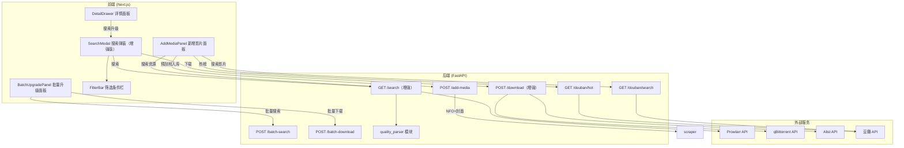

# 技术设计文档：视频搜索升级与新增影片

## 概述

本设计为 NAS 影视媒体库管理工具新增两大核心功能：**搜索升级**和**新增影片**。

**搜索升级**：用户可对媒体库中的低质量视频搜索更高质量的 BT 资源，支持单个和批量操作。系统通过 Prowlarr API 搜索资源，从标题中解析完整的质量标签（分辨率、来源、编码、字幕），与当前视频质量对比后高亮推荐，用户可按多维度筛选并选择通过 qBittorrent 或 Alist 下载。

**新增影片**：用户可通过豆瓣热榜发现或搜索新影片，选择后搜索 BT 资源下载，系统自动使用豆瓣信息生成 NFO 和封面完成预刮削入库。

两个功能共享搜索源（Prowlarr）、下载通道（qBittorrent/Alist）和筛选过滤体系。

### 设计目标

- 复用已有的 `searcher.py`、`downloader.py`、`douban_client.py`、`scraper.py` 模块，最小化新增代码
- 前端复用并增强现有 `SearchModal` 组件，新增筛选和质量对比能力
- 后端增强现有 `/search` 和 `/download` 端点，新增批量和豆瓣热榜端点
- 保持与现有架构风格一致：FastAPI + Pydantic 模型 + EventSource 流式进度

## 架构

### 整体架构图



### 模块变更清单

| 模块 | 变更类型 | 说明 |
|------|----------|------|
| `backend/searcher.py` | 增强 | `_parse_quality` 升级为完整质量解析（编码、音频、字幕） |
| `backend/main.py` | 增强 | 增强 `/search`、`/download`，新增 `/batch-search`、`/batch-download`、`/douban/hot`、`/douban/search`、`/add-media` |
| `backend/douban_client.py` | 增强 | 新增 `get_hot_list(type)` 方法 |
| `backend/quality_parser.py` | 新增 | 独立的质量解析模块，供搜索和筛选共用 |
| `frontend/components/search/SearchModal.tsx` | 重构 | 增加筛选栏、质量对比、下载通道选择、关键词编辑 |
| `frontend/components/search/FilterBar.tsx` | 新增 | 可组合筛选条件组件 |
| `frontend/components/search/BatchUpgradePanel.tsx` | 新增 | 批量升级进度和汇总面板 |
| `frontend/components/media/AddMediaPanel.tsx` | 新增 | 新增影片面板（豆瓣发现+搜索+下载） |
| `frontend/lib/api.ts` | 增强 | 新增 API 方法封装 |
| `frontend/types/index.ts` | 增强 | 新增类型定义 |


## 组件与接口

### 后端接口

#### 1. 质量解析模块 `backend/quality_parser.py`

独立模块，从 BT 资源标题中解析完整质量信息。

```python
from pydantic import BaseModel
from typing import Optional

class QualityTag(BaseModel):
    resolution: str          # "720p" | "1080p" | "2160p" | ""
    source: str              # "Bluray" | "WEB-DL" | "Remux" | "HDTV" | ""
    video_codec: str         # "x264" | "x265" | "HEVC" | "AV1" | ""
    audio_codec: str         # "AAC" | "DTS" | "DTS-HD" | "TrueHD" | "Atmos" | ""
    has_chinese_sub: bool    # 标题中是否包含中文字幕标记
    display: str             # 格式化显示字符串，如 "Bluray-2160p-x265-DTS-中字"

class QualityLevel(BaseModel):
    """质量等级，用于排序对比"""
    rank: int                # 数值越大质量越高
    label: str               # 等级标签

def parse_quality(title: str) -> QualityTag:
    """从 BT 标题解析完整质量标签"""
    ...

def get_quality_level(tag: QualityTag) -> QualityLevel:
    """根据 QualityTag 计算质量等级排名"""
    # 优先级：2160p Remux > 2160p Bluray > 2160p WEB-DL > 1080p Remux > 1080p Bluray > 1080p WEB-DL > 720p > 其他
    ...

def compare_quality(current_resolution: str, result_tag: QualityTag) -> str:
    """对比当前视频与搜索结果的质量，返回 "higher" | "equal" | "lower" """
    ...
```

#### 2. 增强 `GET /search`

现有端点增强，返回结果增加完整 `quality_tag` 对象。

```
GET /search?query=xxx
Response: {
    "query": str,
    "bt_count": int,
    "bt_results": [
        {
            "title": str,
            "size_gb": float,
            "indexer": str,
            "seeders": int,
            "leechers": int,
            "download_url": str,
            "info_url": str | null,
            "quality_tag": str,           # 显示用字符串
            "quality": {                   # 新增：结构化质量信息
                "resolution": str,
                "source": str,
                "video_codec": str,
                "audio_codec": str,
                "has_chinese_sub": bool
            },
            "quality_rank": int            # 新增：质量等级排名
        }
    ]
}
```

#### 3. 增强 `POST /download`

增加 `download_type` 参数支持通道选择。

```
POST /download
Body: {
    "url": str,
    "save_path": str,
    "download_type": "qb" | "alist"   # 新增，默认 "qb"
}
Response: { "success": bool, "message": str }
```

#### 4. 新增 `POST /batch-search`

EventSource 流式返回批量搜索进度。

```
POST /batch-search
Body: {
    "items": [
        { "name": str, "path": str, "current_resolution": str }
    ]
}
Response (EventSource):
    { "type": "progress", "index": int, "total": int, "name": str, "status": "searching" }
    { "type": "result", "index": int, "name": str, "best_match": SearchResult | null, "all_results": [...] }
    { "type": "done", "found": int, "not_found": int }
```

#### 5. 新增 `POST /batch-download`

```
POST /batch-download
Body: {
    "tasks": [
        { "download_url": str, "save_path": str, "download_type": "qb" | "alist" }
    ]
}
Response: {
    "results": [
        { "index": int, "success": bool, "message": str }
    ]
}
```

#### 6. 新增 `GET /douban/hot`

```
GET /douban/hot?type=movie|tv
Response: {
    "type": str,
    "items": [
        {
            "douban_id": str,
            "title": str,
            "year": str,
            "rating": float,
            "cover_url": str,
            "subtitle": str,
            "episode": str
        }
    ]
}
```

#### 7. 新增 `GET /douban/search`

复用已有 `douban_client.search()`，包装为独立端点。

```
GET /douban/search?query=xxx
Response: {
    "query": str,
    "candidates": [...]   # 同现有 /scrape/douban 格式
}
```

#### 8. 新增 `POST /add-media`

在目标目录创建文件夹并生成预刮削 NFO + 封面。

```
POST /add-media
Body: {
    "title": str,
    "original_title": str,
    "year": str,
    "douban_id": str,
    "rating": float,
    "overview": str,
    "genres": [str],
    "director": str,
    "cast": [str],
    "poster_url": str,
    "save_path": str          # 目标根目录
}
Response: {
    "status": "ok",
    "folder_path": str,       # 创建的文件夹路径
    "nfo_written": bool,
    "poster_downloaded": bool
}
```

### 前端组件

#### 1. 增强 `SearchModal`

```typescript
interface SearchModalProps {
  open: boolean;
  query: string;
  onClose: () => void;
  defaultSavePath: string;
  currentResolution?: string;     // 新增：当前视频分辨率，用于质量对比
  qbConfigured?: boolean;         // 新增：qBittorrent 是否已配置
  alistConfigured?: boolean;      // 新增：Alist 是否已配置
}
```

新增功能：
- 顶部显示当前视频分辨率作为对比基准
- 可编辑搜索关键词 + 重新搜索
- 筛选条件栏（FilterBar 子组件）
- 搜索结果按做种数降序排列
- 质量高于当前视频的结果绿色高亮，等于或低于灰色
- 下载按钮提供 qBittorrent / Alist 通道选择

#### 2. 新增 `FilterBar`

```typescript
interface FilterState {
  minResolution: "" | "720p" | "1080p" | "2160p";
  source: "" | "Bluray" | "WEB-DL" | "Remux";
  videoCodec: "" | "x265" | "x264";
  audioCodec: "" | "DTS" | "DTS-HD" | "TrueHD" | "Atmos" | "AAC";
  chineseSubOnly: boolean;
  maxSizeGb: number | null;
  minSeeders: number;            // 默认 1
}

interface FilterBarProps {
  filters: FilterState;
  onChange: (filters: FilterState) => void;
  onClear: () => void;
}
```

筛选逻辑在前端执行（搜索结果已全量返回），实时过滤无需重新请求。

#### 3. 新增 `BatchUpgradePanel`

```typescript
interface BatchUpgradeTask {
  name: string;
  path: string;
  currentResolution: string;
  status: "pending" | "searching" | "found" | "not_found" | "error";
  bestMatch: SearchResult | null;
  allResults: SearchResult[];
  confirmed: boolean;
}

interface BatchUpgradePanelProps {
  tasks: BatchUpgradeTask[];
  onConfirmAll: () => void;
  onConfirmSingle: (index: number) => void;
  onRemoveTask: (index: number) => void;
  onDownloadAll: (downloadType: "qb" | "alist") => void;
  phase: "searching" | "review" | "downloading" | "done";
  progress: { current: number; total: number; currentName: string };
  downloadResult: { success: number; failed: number };
}
```

#### 4. 新增 `AddMediaPanel`

```typescript
interface AddMediaPanelProps {
  open: boolean;
  onClose: () => void;
  onRefresh: () => void;         // 入库后刷新媒体库
  defaultSavePath: string;       // NAS 根路径
}
```

面板内部状态流转：
1. 初始态：展示豆瓣热榜（电影/剧集 tab 切换）+ 搜索框
2. 选择影片后：展示影片信息 + BT 搜索结果（复用 FilterBar）
3. 选择资源后：选择保存目录 + 下载通道 → 下载 + 预刮削


## 数据模型

### 后端 Pydantic 模型

```python
# quality_parser.py
class QualityTag(BaseModel):
    resolution: str = ""
    source: str = ""
    video_codec: str = ""
    audio_codec: str = ""
    has_chinese_sub: bool = False
    display: str = ""

class QualityLevel(BaseModel):
    rank: int = 0
    label: str = ""

# searcher.py（增强）
class SearchResult(BaseModel):
    title: str
    size_gb: float
    indexer: str
    seeders: int
    leechers: int
    download_url: str
    info_url: Optional[str] = None
    quality_tag: str                    # 显示用字符串
    quality: Optional[QualityTag] = None  # 新增：结构化质量
    quality_rank: int = 0               # 新增：质量等级排名

# main.py 请求模型
class DownloadRequest(BaseModel):
    url: str
    save_path: str
    download_type: str = "qb"           # "qb" | "alist"

class BatchSearchItem(BaseModel):
    name: str
    path: str
    current_resolution: str = ""

class BatchSearchRequest(BaseModel):
    items: List[BatchSearchItem]

class BatchDownloadTask(BaseModel):
    download_url: str
    save_path: str
    download_type: str = "qb"

class BatchDownloadRequest(BaseModel):
    tasks: List[BatchDownloadTask]

class AddMediaRequest(BaseModel):
    title: str
    original_title: str = ""
    year: str = ""
    douban_id: str = ""
    rating: float = 0
    overview: str = ""
    genres: List[str] = []
    director: str = ""
    cast: List[str] = []
    poster_url: str = ""
    save_path: str
```

### 前端 TypeScript 类型

```typescript
// types/index.ts 新增

export interface QualityTag {
  resolution: string;
  source: string;
  video_codec: string;
  audio_codec: string;
  has_chinese_sub: boolean;
  display: string;
}

export interface EnhancedSearchResult extends SearchResult {
  quality: QualityTag;
  quality_rank: number;
}

export interface FilterState {
  minResolution: "" | "720p" | "1080p" | "2160p";
  source: "" | "Bluray" | "WEB-DL" | "Remux";
  videoCodec: "" | "x265" | "x264";
  audioCodec: "" | "DTS" | "DTS-HD" | "TrueHD" | "Atmos" | "AAC";
  chineseSubOnly: boolean;
  maxSizeGb: number | null;
  minSeeders: number;
}

export interface BatchUpgradeTask {
  name: string;
  path: string;
  currentResolution: string;
  status: "pending" | "searching" | "found" | "not_found" | "error";
  bestMatch: EnhancedSearchResult | null;
  allResults: EnhancedSearchResult[];
  confirmed: boolean;
}

export interface DoubanHotItem {
  douban_id: string;
  title: string;
  year: string;
  rating: number;
  cover_url: string;
  subtitle: string;
  episode: string;
}

export interface AddMediaInfo {
  title: string;
  original_title: string;
  year: string;
  douban_id: string;
  rating: number;
  overview: string;
  genres: string[];
  director: string;
  cast: string[];
  poster_url: string;
}
```

### 质量等级排名规则

质量等级按以下优先级从高到低排列，`rank` 值越大质量越高：

| rank | 等级 | 说明 |
|------|------|------|
| 8 | 2160p Remux | 4K 原盘 |
| 7 | 2160p Bluray | 4K 蓝光压制 |
| 6 | 2160p WEB-DL | 4K 流媒体 |
| 5 | 1080p Remux | 1080p 原盘 |
| 4 | 1080p Bluray | 1080p 蓝光压制 |
| 3 | 1080p WEB-DL | 1080p 流媒体 |
| 2 | 720p | 720p 任意来源 |
| 1 | 其他 | 无法识别或更低 |

### 分辨率对比规则

当前视频分辨率从 `VideoInfo.height` 映射：
- height >= 2160 → "2160p"
- height >= 1080 → "1080p"
- height >= 720 → "720p"
- 其他 → "SD"

搜索结果的 `quality.resolution` 高于当前视频分辨率 → 绿色高亮（"higher"）
等于或低于 → 灰色（"equal" 或 "lower"）


## 正确性属性

*正确性属性是指在系统所有有效执行中都应成立的特征或行为——本质上是对系统应做什么的形式化陈述。属性是人类可读规格说明与机器可验证正确性保证之间的桥梁。*

### 属性 1：质量标签解析正确性

*对于任意*包含已知质量标记（分辨率、来源、编码、字幕关键词）的 BT 资源标题字符串，`parse_quality` 函数应正确提取所有存在的标记：若标题包含 "2160p" 则 `resolution` 应为 "2160p"，若包含 "x265" 或 "HEVC" 则 `video_codec` 应为 "x265"，若包含 "中字"/"CHS"/"CHT"/"简繁" 等中文字幕关键词则 `has_chinese_sub` 应为 `true`。解析结果的 `display` 字段应包含所有已解析的非空标记。

**验证需求：1.2**

### 属性 2：质量等级排序一致性与传递性

*对于任意*两个 QualityTag `a` 和 `b`，`get_quality_level` 返回的 rank 值应满足全序关系：若 `a` 的分辨率更高或同分辨率下来源更优，则 `rank(a) > rank(b)`。此外，排序应具有传递性：若 `rank(a) > rank(b)` 且 `rank(b) > rank(c)`，则 `rank(a) > rank(c)`。`compare_quality` 函数应与此排序一致：当搜索结果的分辨率高于当前视频时返回 "higher"，等于时返回 "equal"，低于时返回 "lower"。

**验证需求：2.2, 2.3, 2.4**

### 属性 3：筛选函数正确性

*对于任意*搜索结果列表和任意筛选条件组合（FilterState），经过筛选后的每一条结果都应满足所有已设置的筛选条件：分辨率不低于 `minResolution`、来源匹配 `source`、视频编码匹配 `videoCodec`、音频编码匹配 `audioCodec`、若 `chineseSubOnly` 为 true 则 `has_chinese_sub` 必须为 true、文件大小不超过 `maxSizeGb`、做种数不低于 `minSeeders`。当所有筛选条件为默认值（空/null）时，筛选结果应等于原始列表。

**验证需求：2.6, 2.7**

### 属性 4：最佳推荐选择算法

*对于任意*非空搜索结果列表，自动推荐算法应选择做种数大于 0 的结果中质量等级（`quality_rank`）最高的一条。若存在用户筛选条件，应先按筛选条件过滤，再从过滤结果中选择最高质量等级且做种数 > 0 的结果。若无满足条件的结果，推荐应为 null。

**验证需求：2.8, 4.3**

### 属性 5：搜索结果结构完整性

*对于任意* Prowlarr API 返回的搜索结果，经过系统处理后的每条结果都应包含所有必需字段：`title` 非空、`size_gb` >= 0、`indexer` 非空、`seeders` >= 0、`download_url` 非空、`quality_tag` 非空、`quality` 对象存在且包含 `resolution`/`source`/`video_codec`/`audio_codec`/`has_chinese_sub` 字段、`quality_rank` >= 0。

**验证需求：5.1, 7.4**

### 属性 6：预刮削 NFO 往返一致性

*对于任意*有效的影片信息（title、year、rating、overview、genres、director、cast），通过 `POST /add-media` 写入 NFO 文件后，再通过 `read_nfo` 读取回来，应得到相同的 title、year、rating、overview、genres、director 和 cast 值。

**验证需求：8.7**

### 属性 7：搜索结果按做种数降序排列

*对于任意*搜索结果列表，经过排序后，列表中每个元素的 `seeders` 值应大于等于其后一个元素的 `seeders` 值。

**验证需求：1.3**


## 错误处理

### 后端错误处理

| 场景 | 处理方式 | HTTP 状态码 |
|------|----------|-------------|
| Prowlarr 未配置（API Key 为空） | 返回错误信息 "Prowlarr API Key not configured" | 400 |
| Prowlarr 搜索超时 | 捕获 `requests.Timeout`，返回 "搜索超时，请重试" | 504 |
| Prowlarr 连接失败 | 捕获 `requests.ConnectionError`，返回 "无法连接 Prowlarr: {url}" | 502 |
| qBittorrent 不可用 | 返回 `{ success: false, message: "无法连接 qBittorrent: {url}" }` | 200 |
| Alist 不可用 | 返回 `{ success: false, message: "无法连接 Alist: {url}" }` | 200 |
| qBittorrent/Alist 未配置 | 返回 `{ success: false, message: "{service} 未配置" }` | 200 |
| 豆瓣热榜接口被反爬 | 返回空列表 `[]`，前端显示"暂无数据" | 200 |
| 豆瓣搜索无结果 | 返回空列表，前端允许直接搜索 BT 资源 | 200 |
| 批量搜索中单个视频失败 | 标记该任务为 "error"，继续处理队列 | — (EventSource) |
| 预刮削目标目录不存在 | 自动创建目录（`os.makedirs`） | — |
| 预刮削海报下载失败 | NFO 正常写入，海报标记为失败，不阻断流程 | 200 |
| 批量下载中单个任务失败 | 记录失败原因，继续处理队列，最终返回汇总 | 200 |

### 前端错误处理

| 场景 | 处理方式 |
|------|----------|
| 搜索 API 返回错误 | SearchModal 显示错误信息，提供"重试"按钮 |
| 搜索无结果 | 显示"未搜到资源"提示，允许编辑关键词重新搜索 |
| 下载推送成功 | Toast 提示"任务已下达"，3 秒后自动关闭弹窗 |
| 下载推送失败 | 显示失败原因，保持弹窗打开，允许重试或选择其他资源 |
| 批量搜索 EventSource 断开 | 显示已完成的结果，提示连接中断 |
| 下载通道未配置 | 对应按钮禁用，显示"未配置"tooltip |
| 豆瓣热榜加载失败 | 显示"加载失败"，提供搜索框作为替代入口 |

## 测试策略

### 测试框架

- 后端：`pytest` + `hypothesis`（属性测试）+ `pytest-asyncio`
- 前端：`vitest` + `fast-check`（属性测试）+ `@testing-library/react`

### 属性测试（Property-Based Testing）

使用 `hypothesis`（Python）和 `fast-check`（TypeScript）进行属性测试，每个属性测试至少运行 100 次迭代。

每个属性测试必须通过注释引用设计文档中的属性编号：

```python
# Feature: video-search-upgrade, Property 1: 质量标签解析正确性
@given(st.text())
def test_quality_tag_parsing(title):
    ...
```

```typescript
// Feature: video-search-upgrade, Property 3: 筛选函数正确性
fc.assert(fc.property(fc.array(searchResultArb), filterStateArb, (results, filters) => {
    ...
}), { numRuns: 100 });
```

#### 后端属性测试

| 属性 | 测试内容 | 生成器 |
|------|----------|--------|
| 属性 1 | `parse_quality` 对包含已知标记的标题正确提取 | 随机组合分辨率/来源/编码/字幕标记生成 BT 标题 |
| 属性 2 | `get_quality_level` 排序一致性和传递性 | 随机生成 QualityTag 三元组 |
| 属性 4 | 推荐算法选择最高质量且做种数 > 0 | 随机生成 SearchResult 列表 + FilterState |
| 属性 5 | 搜索结果结构完整性 | 随机生成 Prowlarr API 原始响应 |
| 属性 6 | NFO 写入后读取往返一致 | 随机生成 ScrapeResult 对象 |
| 属性 7 | 排序后做种数降序 | 随机生成 SearchResult 列表 |

#### 前端属性测试

| 属性 | 测试内容 | 生成器 |
|------|----------|--------|
| 属性 2 | `compareQuality` 函数一致性 | 随机生成分辨率对 |
| 属性 3 | 筛选函数正确性 | 随机生成 EnhancedSearchResult[] + FilterState |
| 属性 7 | 排序后做种数降序 | 随机生成 SearchResult[] |

### 单元测试

单元测试覆盖具体示例、边界情况和集成点：

| 测试 | 类型 | 说明 |
|------|------|------|
| `parse_quality("Inception.2010.2160p.Bluray.x265.DTS-HD.CHS")` | 示例 | 验证完整标题解析 |
| `parse_quality("")` | 边界 | 空标题返回全空 QualityTag |
| `parse_quality("Some.Random.Title")` | 边界 | 无质量标记返回空 resolution |
| `compare_quality("1080p", tag_2160p)` | 示例 | 返回 "higher" |
| `compare_quality("2160p", tag_1080p)` | 示例 | 返回 "lower" |
| 筛选：仅设置 `minResolution=2160p` | 示例 | 只保留 2160p 结果 |
| 筛选：`chineseSubOnly=true` | 示例 | 只保留有中文字幕的结果 |
| 筛选：`maxSizeGb=10` | 边界 | 过滤掉大于 10GB 的结果 |
| 下载路由：`download_type="qb"` | 集成 | 验证调用 qBittorrent 客户端 |
| 下载路由：`download_type="alist"` | 集成 | 验证调用 Alist 客户端 |
| 预刮削：创建文件夹 + NFO + 海报 | 集成 | 验证完整入库流程 |
| Prowlarr 未配置时搜索 | 边界 | 返回 400 错误 |
| 批量搜索中单个失败 | 边界 | 不影响其他任务 |
| 豆瓣热榜接口返回空 | 边界 | 前端正常显示空状态 |

