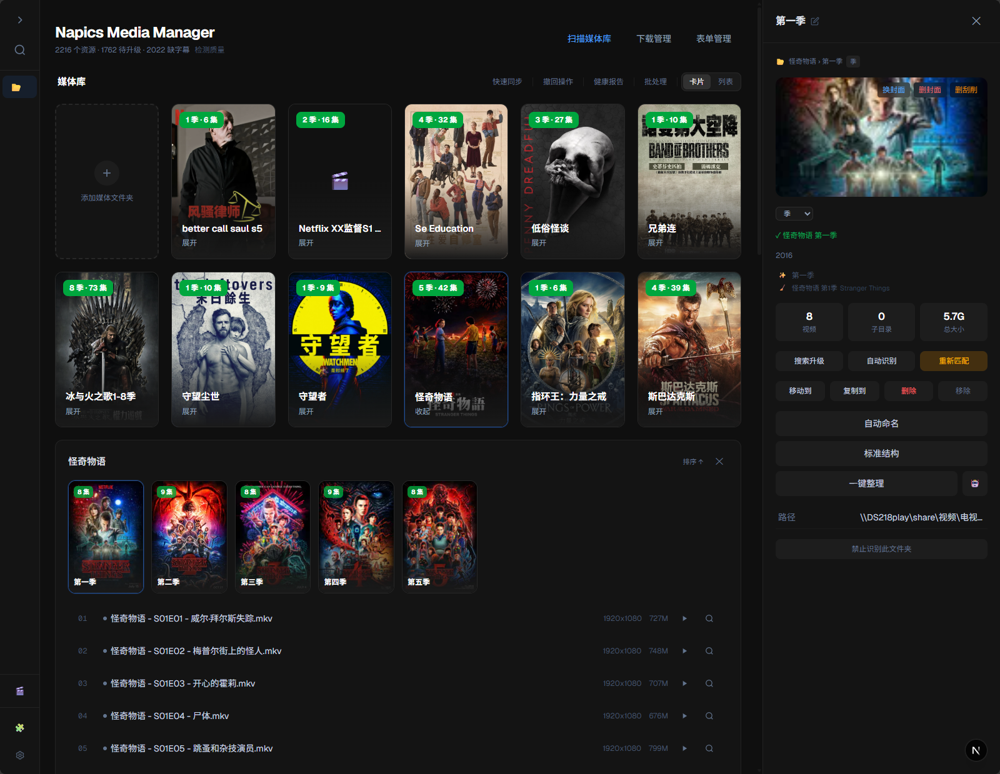
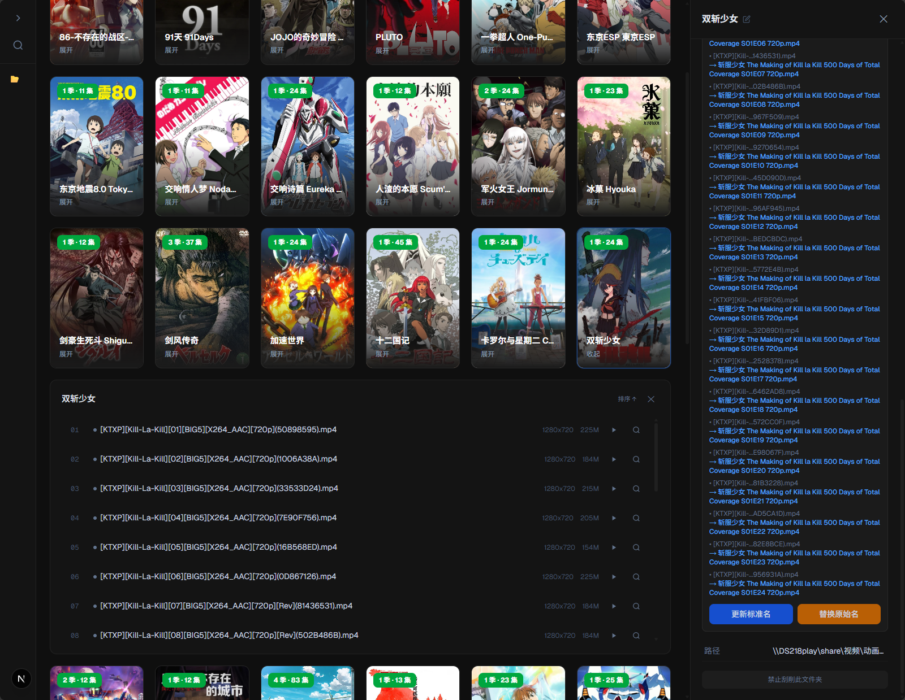
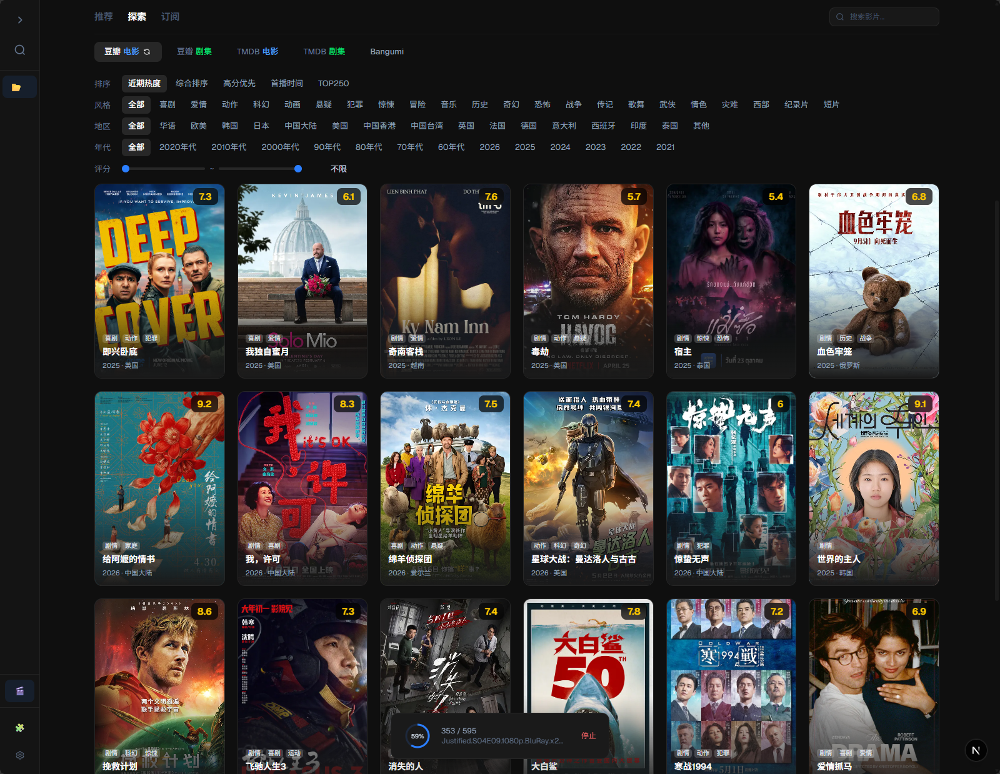
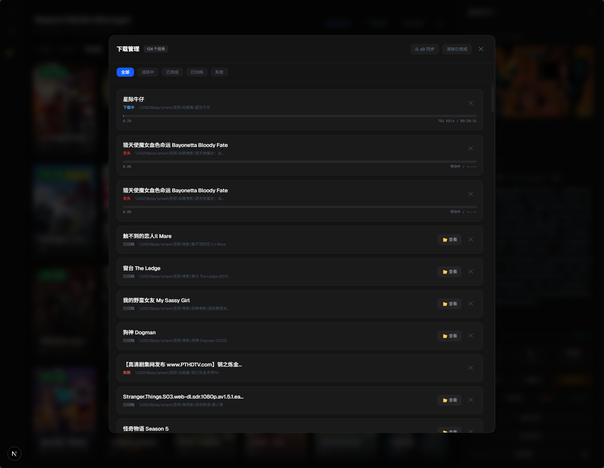
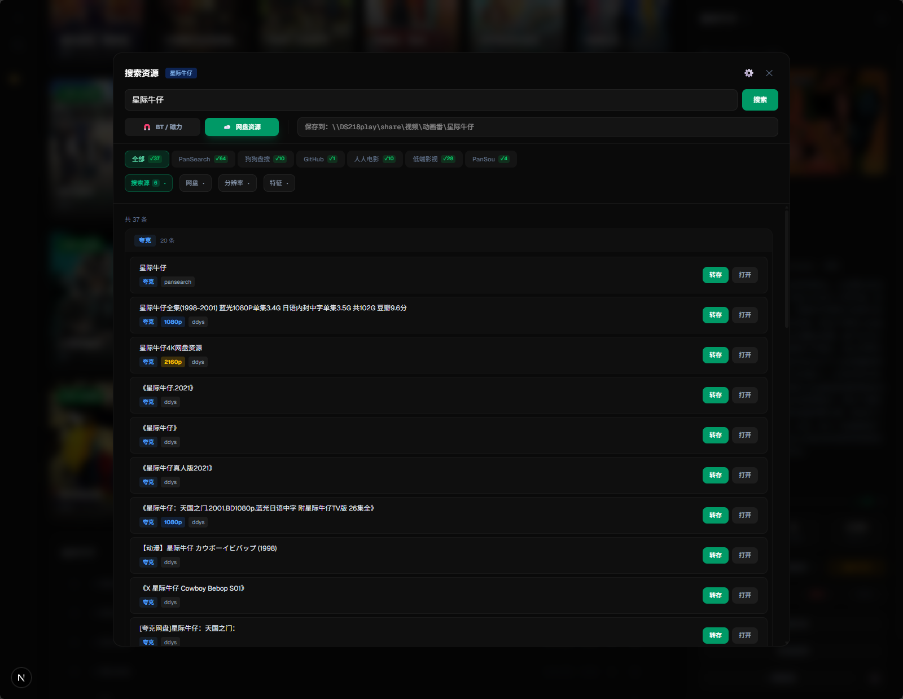
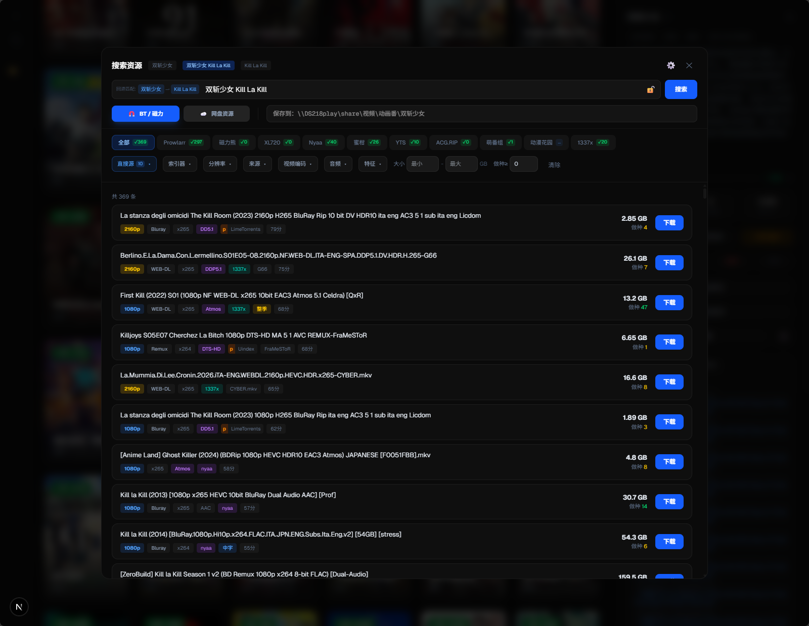
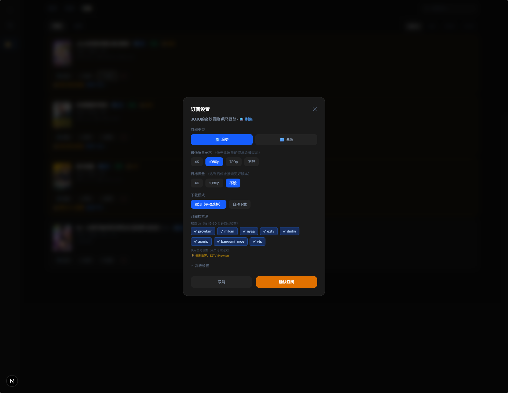

<div align="center">

# Napics

**智能媒体资产管理系统**

扫描、识别、整理、元数据管理（刮削）、质量分析与升级维护 ——
面向 PC / NAS 用户的智能媒体资产管理系统。

[](LICENSE)
[](https://python.org)
[](https://nextjs.org)


</div>

---

## 为什么是 Napics


Napics 不试图替代 Plex/Jellyfin 做家庭影院。
它解决的是：

> 为什么你的媒体库总是越来越乱。

你可能已经有 Plex/Jellyfin 来播放，
有 MoviePilot/NasTools 来自动获取资源。

但：

- 文件名混乱
- 季集缺失
- 海报与 NFO 不完整
- 画质参差不齐
- 重复资源难以整理
- 老资源无法持续升级

Napics 关注的是：

> 管理、质量与长期维护。

核心聚焦于：
- 组织架构
- 元数据质量（刮了个削）
- 媒体内容一致性
- 长期可维护性
- 扩展功能可通过插件实现。

---


## 核心能力


### 媒体库管理与质量分析

- 自动扫描目录，识别视频元信息（分辨率、编码、HDR、字幕轨）
- 智能识别文件夹类型（电影 / 剧集 / 系列电影 / 分类聚合）
- 舒适交互，不同类型不同UI/UX方式，一目了然
- 100 分制质量评分，低画质一目了然
- 多视图浏览：目录树、详情卡片、表单管理

### 智能整理与刮削

- 多源刮削（TMDB + 可扩展元数据源），自动匹配海报和 NFO
- AI 辅助分类判定 + 季目录归位 + 智能重命名
- 平级展开，不同类型不同 UI 交互方式


### 媒体升级与维护

- 下载完成自动归位，整体替换
- 批量升级：检测低画质 → 搜索更高质量版本 → 替换
- 基于媒体库偏好的个性化推荐
- 季集完整性检测，缺什么搜什么

### 在线预览与字幕

- 浏览器内直接播放，无需跳转外部播放器
- mp4 直接流式播放；mkv / ts / avi 走 ffmpeg 实时转封装
- 内嵌字幕自动提取转 WebVTT，外挂 srt / ass / ssa / sub 自动识别编码
- 多音轨切换，图形字幕（PGS / VobSub）会明确标注为不可渲染而非静默忽略
- 字幕搜索插件可按剧集精确匹配并一键下载

### 插件拓展

- 插件拓展能力。搜索/下载/订阅/播放/字幕
- 聚合 BT / 网盘多源搜索，智能关键词回退
- 期待更多的模块化的功能


---

## 截图

<details>
<summary>展开查看更多截图</summary>

| 功能 | 截图 |
|------|------|
| 剧集管理 |  |
| 智能重命名 |  |
| 发现推荐 |  |
| 下载管理 |  |
| 网盘浏览 |  |
| 智能搜索 |  |
| RSS 订阅 |  |

</details>

---

## 插件系统

- 内置插件中心，支持一键安装/卸载
- 支持添加第三方插件源 URL
- 提供 SDK 和模板仓库，可开发自定义插件

详见 [插件开发指南](backend/plugins/PLUGIN_DEV_GUIDE.md)

---

## 快速开始

### 环境要求

- Python 3.10+
- Node.js 18+
- ffmpeg / ffprobe —— 扫描视频元信息、播放 mkv 等格式、提取内嵌字幕都要用
  （Docker 镜像已内置，源码部署需自行安装并确保在 PATH 中）

### 安装运行

```bash
git clone https://github.com/Kami-pic/napics.git
cd napics

# 后端
cd backend
pip install -r requirements.txt
python -m uvicorn main:app --host 0.0.0.0 --port 8001

# 前端（新终端）
cd frontend
npm install
npm run dev
```

访问 `http://localhost:3032`

### Windows 一键启动

```bash
start_all.bat
```

### Docker

前后端打包在同一个镜像里，**一个容器、一个端口**就能跑起来。

镜像地址（任选其一，国内建议用加速地址）：

| 来源 | 地址 | 说明 |
|---|---|---|
| Docker Hub | `kamipic/napics:latest` | 国内 NAS 通常已配加速器，最快 |
| GHCR 加速 | `ghcr.nju.edu.cn/kami-pic/napics:latest` | 教育网镜像站代理 |
| GHCR 原始 | `ghcr.io/kami-pic/napics:latest` | 国内可能很慢或超时 |

拉不动的话还可以下载离线镜像包导入，见下方「离线安装」。

#### 方式一：NAS 图形界面（飞牛 / 群晖 / 威联通）

不需要 SSH，在 NAS 的 Docker 管理界面里操作：

1. **镜像** → 添加/拉取 → 填 `ghcr.io/kami-pic/napics:latest`
2. 等下载完成 → **创建容器**
3. 按下表配置

| 配置项 | 填什么 |
|---|---|
| 网络模式 | **host**（强烈建议，见下方说明） |
| 目录挂载 | 你的视频目录 → 容器内**填写完全相同的路径** |
| 目录挂载 | 一个空目录（存配置）→ 容器内 `/app/data` |

4. 启动，访问 `http://<NAS-IP>:3032`

**为什么建议 host 网络模式**：

- NAS 的 Docker 默认桥接网络经常拿不到可用 DNS，会导致容器内域名全部解析失败，
  刮削、搜索、发现页、插件源统统不可用
- host 模式下容器共用宿主机网络栈，DNS 直接可用
- 装在 NAS 上的 qBittorrent / Prowlarr / OpenList 可以直接用 `http://127.0.0.1:端口` 访问，
  不需要额外配置
- 后端只监听 `127.0.0.1:8001`，局域网其他设备访问不到，安全性不降低

用 host 模式时不需要端口映射，直接访问 `3032`。端口冲突可用环境变量 `PORT` 改。

如果只能用桥接网络，需要额外做两件事：给容器指定 DNS（如 `223.5.5.5`），
以及把 NAS 上其他服务的地址填成 `http://host.docker.internal:端口`。

可选环境变量：`TZ`（默认 `Asia/Shanghai`）、`PORT`（默认 `3032`）。

#### 方式二：命令行

推荐 host 网络（原因见上）：

```bash
docker run -d \
  --name napics \
  --network host \
  -e PORT=3032 \
  -v /vol1/1000/视频:/vol1/1000/视频 \
  -v napics-data:/app/data \
  --restart unless-stopped \
  ghcr.io/kami-pic/napics:latest
```

只能用桥接网络时：

```bash
docker run -d \
  --name napics \
  -p 3032:3032 \
  -v /vol1/1000/视频:/media \
  -v napics-data:/app/data \
  --dns 223.5.5.5 \
  --add-host host.docker.internal:host-gateway \
  --restart unless-stopped \
  ghcr.io/kami-pic/napics:latest
```

#### 方式三：Docker Compose

```bash
mkdir -p napics && cd napics
curl -O https://raw.githubusercontent.com/Kami-pic/napics/release/docker-compose.yml
curl -o .env https://raw.githubusercontent.com/Kami-pic/napics/release/.env.example
nano .env          # 把 MEDIA_PATH 改成你的媒体目录
docker compose up -d
```

<details>
<summary>部署后的几个要点</summary>

**1. 扫描路径要填容器内路径**

你挂载的宿主机目录在容器里是 `/media`，所以设置页里填 `/media/电影` 这样的路径，
不要填 `/vol1/1000/视频`。

**2. 必须先配好扫描路径**

出于安全考虑，文件操作被限制在已配置的媒体库范围内。没配路径时，
封面、重命名、删除等操作会提示「路径不在媒体库范围内」。

**3. 访问 NAS 上的 qBittorrent / OpenList**

容器内的 `127.0.0.1` 指向容器自己。这些服务的地址要填
`http://host.docker.internal:8080` 这种形式。
用图形界面创建容器时，如果没有「添加主机」选项，改填 NAS 的局域网 IP 也可以。

**4. 路径填错会有提示**

设置页的路径输入框会实时校验服务端能否访问该路径。填了容器里不存在的路径时
会显示黄色警告，可访问则显示绿色对勾。旁边的文件夹按钮是网页版浏览器，
可以直接点选目录，不依赖桌面环境。

**5. 数据存放位置**

配置和媒体库索引都在 `/app/data`，只要这个目录挂载出来，
更新镜像不会丢数据。

</details>

<details>
<summary>离线安装（网络拉不动镜像时）</summary>

1. 打开仓库的 Actions 页面，点最近一次成功的构建
2. 滚到页面底部 `Artifacts`，下载 `napics-docker-image-tar`
3. 解压得到 `napics-image.tar.gz`，传到 NAS
4. NAS 的 Docker 界面 → 镜像 → 导入，选择该文件

命令行方式：

```bash
gunzip -c napics-image.tar.gz | docker load
```

</details>

<details>
<summary>更新与本地构建</summary>

更新：拉新镜像后重建容器即可，`/app/data` 里的数据不受影响。

```bash
docker compose pull && docker compose up -d
```

从源码构建：

```bash
docker build -t napics:local .
```

</details>
---

## 配置

首次启动后在设置页配置：

1. **TMDB API Key** — [申请地址](https://www.themoviedb.org/settings/api) （建议使用）
2. **扫描路径** — 媒体库目录（支持网络路径）
3. **可选插件** — （BT 下载 / OpenList / 在线播放 / 字幕搜索）（可选）
4. **HTTP 代理** — 海外服务访问（可选）

---

## 已知限制

在线播放部分：

- **rmvb / rm 不支持浏览器播放**。这类文件用 RealVideo 编码，浏览器无法解码，
  也不能像 mkv 那样只换容器，必须整段重编码视频流，NAS 上开销过大。请用本地播放器打开。
- **图形字幕（PGS / VobSub）无法显示**。它们是图片而不是文本，需要 OCR 才能转成字幕。
  播放器会把这类轨明确标注出来，不会让你误以为片源没有字幕。
- **压制进画面的硬字幕无法关闭**。硬字幕是画面像素的一部分，检测不到也去不掉。
- mkv / ts 首次加载有十几秒等待，转码是实时进行的。
- 内嵌字幕首次提取需要读完整个文件（约 6 秒/GB），之后走缓存秒开。

其他：

- 单机单用户设计，没有账号体系，请勿直接暴露到公网。
- 媒体库用 JSON 文件存储，十万级条目以上可能出现明显延迟。

---

## 技术栈

| 层 | 技术 |
|----|------|
| 后端 | Python · FastAPI · Uvicorn |
| 前端 | Next.js 16 · React 19 · Tailwind CSS 4 |
| 媒体 | ffmpeg / ffprobe（元信息、转码、字幕提取） |
| 数据 | JSON 文件持久化（无数据库依赖） |

---

## 贡献

欢迎提交 Issue 和 Pull Request！详见 [贡献指南](CONTRIBUTING.md)。

> 肯定有很多bug...一个人测不过来... 独自出工，我的agent 牛马出的力。 特别想赚钱给他把饲料升级成咖啡 :p

---

## 法律声明

Napics 是一个媒体资产管理工具，提供插件扩展机制。

- Napics 不提供资源发现服务，也不提供任何默认资源站配置。
- 搜索、下载、订阅能力取决于用户安装的第三方插件。
- 第三方插件由其各自维护者负责，与本项目无关
- 用户应确保其使用方式符合当地法律法规


---

## License

[GPL-3.0](LICENSE)

---
