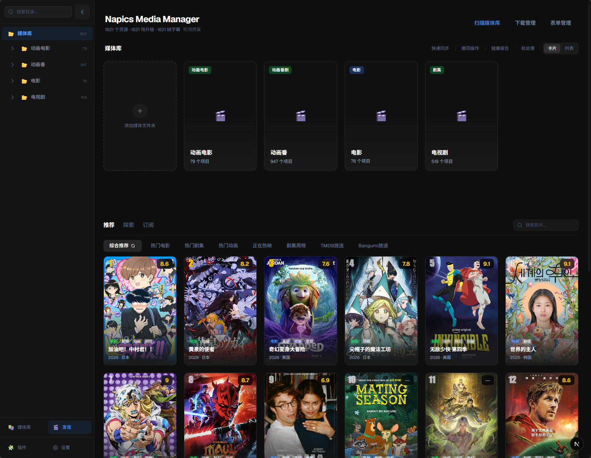

<div align="center">

# Napics

**智能媒体资产管理系统 · Smart Media Asset Manager**

面向 NAS 高阶用户的一站式影视管理工具——自动刮削、智能整理、全网搜索、一键下载。

A one-stop media management tool for NAS power users — auto-scraping, smart organizing, universal search, and one-click download.



[](LICENSE)
[](https://python.org)
[](https://nextjs.org)

</div>

---

## ✨ 功能特性

### 媒体库管理
- 📂 **自动扫描** — 递归扫描 NAS 目录，自动识别视频文件元信息（分辨率、编码、HDR、字幕）
- 🎬 **智能刮削** — 多源元数据匹配（TMDB / 豆瓣 / Bangumi），自动下载海报和 NFO
- 📊 **质量评估** — 100 分制质量评分，一眼识别低画质文件
- 🗂️ **结构整理** — AI 辅助分类判定 + 季目录归位 + 智能重命名

### 搜索与下载
- 🔍 **全网搜索** — 聚合 BT/PT/网盘多源搜索，智能关键词回退
- ⚡ **流式结果** — SSE 实时推送搜索进度，边搜边看
- 📥 **一键下载** — 对接 qBittorrent / OpenList(Alist)，下载完成自动归位
- 🔄 **批量升级** — 检测低画质文件，一键搜索更高质量版本替换

### 发现与订阅
- 🎯 **智能推荐** — 基于媒体库偏好的个性化推荐
- 📡 **RSS 订阅** — 自动追更新番/新剧，洗版升级
- 📅 **完整性检测** — 季集缺失检测，缺什么搜什么

### 插件生态
- 🧩 **插件架构** — 搜索源、元数据源、下载器均可插件化扩展
- 🌐 **社区插件** — 第三方插件源一键安装（BT 直搜、网盘搜索、RSS 源）
- 🔧 **开发者友好** — 提供 SDK + 模板仓库，轻松开发自定义插件

---

## 🚀 快速开始

### 环境要求

- Python 3.10+
- Node.js 18+
- 推荐：qBittorrent（BT 下载）、Prowlarr（搜索聚合）

### 安装运行

```bash
# 克隆仓库
git clone https://github.com/kami-pc/napics.git
cd napics

# 后端
cd backend
pip install -r requirements.txt
python -m uvicorn main:app --host 0.0.0.0 --port 8000

# 前端（新终端）
cd frontend
npm install
npm run dev
```

打开浏览器访问 `http://localhost:3000`

### Windows 一键启动

```bash
# 启动前后端
start_all.bat

# 停止
stop_all.bat
```

---

## 📸 截图

| 媒体库 | 搜索 | 详情 |
|--------|------|------|
|  | *搜索截图待补* | *详情截图待补* |

---

## 🏗️ 技术栈

| 层 | 技术 |
|----|------|
| 后端 | Python 3 + FastAPI + Uvicorn |
| 前端 | Next.js 16 + React 19 + Tailwind CSS 4 |
| 数据 | JSON 文件持久化（无数据库依赖） |
| 外部服务 | TMDB / Prowlarr / qBittorrent / OpenList / 豆瓣 / Bangumi |

---

## 🧩 插件系统

Napics 采用 Open Core 架构：核心功能完全开源，通过插件扩展能力。

### 内置插件（开箱即用）

| 插件 | 说明 |
|------|------|
| metadata-tmdb | TMDB 影视元数据 |
| metadata-bangumi | Bangumi 动画元数据 |
| download-qbittorrent | qBittorrent 下载对接 |
| feature-completeness | 季集完整性检测 |
| feature-discover | 智能推荐 |
| feature-local-match | 本地媒体感知 |

### 社区插件（第三方源安装）

BT 直搜（12 源）、网盘搜索（9 源）、RSS 订阅、Prowlarr 对接、豆瓣元数据、OpenList 存储等。

安装方式：插件中心 → 第三方插件源（已预置官方社区源）

### 开发自己的插件

```bash
pip install napics-plugin-sdk
```

详见 [插件开发指南](backend/plugins/PLUGIN_DEV_GUIDE.md)

---

## ⚙️ 配置

首次启动后在设置页配置：

1. **TMDB API Key** — 影视元数据（[申请地址](https://www.themoviedb.org/settings/api)）
2. **HTTP 代理** — TMDB 等海外服务需要
3. **扫描路径** — 你的媒体库目录（支持 NAS SMB 路径）
4. **qBittorrent** — BT 下载（可选）
5. **Prowlarr** — 搜索聚合（可选）

所有配置存储在 `backend/config.json`，不上传到 Git。

---

## 📁 项目结构

```
napics/
├── backend/          # Python 后端（FastAPI）
│   ├── main.py       # 入口
│   ├── routes/       # API 路由
│   ├── plugins/      # 插件目录
│   └── tests/        # 测试
├── frontend/         # Next.js 前端
│   ├── app/          # 页面
│   ├── components/   # UI 组件
│   └── hooks/        # 自定义 Hooks
├── napics-plugin-sdk/    # 插件开发 SDK
├── napics-plugin-template/ # 插件模板
└── community-plugins/    # 社区插件源代码
```

---

## 🤝 贡献

欢迎提交 Issue 和 Pull Request。

- Bug 报告请附带复现步骤和日志
- 功能建议请先开 Issue 讨论
- 插件贡献请参考 [插件开发指南](backend/plugins/PLUGIN_DEV_GUIDE.md)

---

## 📄 License

[GPL-3.0](LICENSE) — 核心代码开源，付费插件（napics-pro）为独立闭源仓库。

---

## 🙏 致谢

- [TMDB](https://www.themoviedb.org/) — 影视元数据
- [Prowlarr](https://prowlarr.com/) — 索引器聚合
- [qBittorrent](https://www.qbittorrent.org/) — BT 下载
- [OpenList](https://github.com/AlistGo/alist) — 网盘挂载
